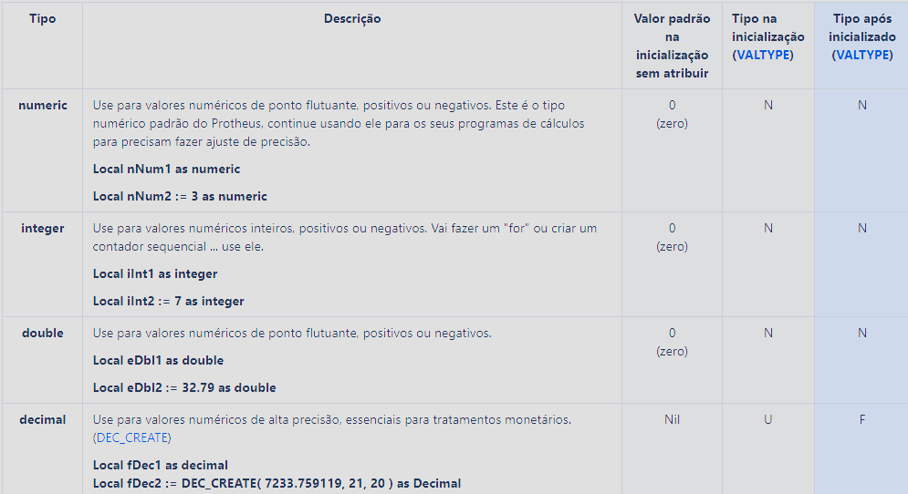
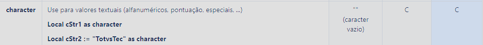
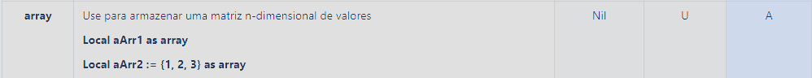
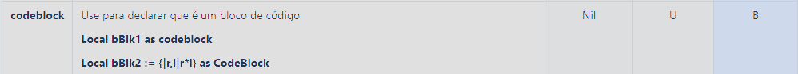

# Declaração e Atribuição de Variáveis

## Sumário

## Tipo de Dados

O ADVPL não é uma linguagem de tipos rígidos (strongly typed), o que significa que variáveis de memória podem receber diferentes tipos de dados durante a execução do programa. As variáveis podem também conter objetos, mas os tipos primários da linguagem são:

### Numéricos

O ADVPL não diferencia valores inteiros de valores com ponto flutuante, portanto podem-se criar variáveis numéricas 
com qualquer valor dentro do intervalo permitido. Os seguintes elementos são do tipo de dado numérico:
2
43.53
0.5
0.00001
1000000
Uma variável do tipo de dado numérico pode conter um número de dezoito dígitos, incluindo o ponto flutuante, no 
intervalo de 2.2250738585072014 E–308 até 1.7976931348623158 E+308.

:exclamation: **Atenção**: 

No TLPP variáveis numéricas ser representadas das seguintes formas:



Obs. Em TLPP, as variáveis de tipo numeric, character e date não devem ser comparados com Nil. Segue um exemplo:

Local nNum as numeric

If (nNum == Nil)

...

EndIf

No exemplo acima, dará erro de compilação, pois a variável nNum é igual a 'N' e já tem o valor default 0 (zero). Caso precise fazer esta comparação com Nil, o tipo de nNum deve ser modificado para Variant.

### Lógicos

Valores lógicos em ADVPL são identificados através de .T. ou .Y. para verdadeiro e .F. ou .N. para falso (independentemente se os caracteres estiverem em maiúsculo ou minúsculo).

Exemplo:

```advpl

lVerdadeiro := .T.
lFalso := .F.

```

:exclamation: **Atenção**: Em TLPP podemos declarar variáveis lógicas das seguintes formas:


### Caracteres

Strings ou cadeias de caracteres são identificadas em ADVPL por blocos de texto entre aspas duplas `(")` ou aspas simples `(')`:

Exemplo:

```advpl

cString1 := "Texto entre aspas duplas"
cString2 := 'Texto entre aspas simples'

```

:exclamation: **Atenção**: Em TLPP podemos declarar variáveis do tipo caractere das seguintes formas:



### Data

O ADVPL possui um tipo de dado específico para datas, que é representado por uma variável do tipo `Date`:

```advpl

dData := DtoD(01,01,2020)

```

Variáveis do tipo de dados Data não podem ser declaradas diretamente, e sim através da utilização de funções específicas como, por exemplo, CTOD() que converte uma string para data.

:exclamation: **Atenção**: Em TLPP podemos declarar variáveis do tipo data das seguintes formas:


### Array

O Array é um tipo de dado especial. É a disposição de outros elementos em colunas e linhas. O ADVPL suporta arrays unidimensionais (vetores) ou multidimensionais (matrizes). Os elementos de um array são acessados através de índices numéricos iniciados em 1, identificando a linha e coluna para quantas dimensões existirem.

Arrays devem ser utilizadas com cautela, pois se forem muito grandes podem exaurir a memória do servidor.

```advpl

aArray := {1,2,3,4,5}

```

:exclamation: **Atenção**: Em TLPP podemos declarar variáveis do tipo array das seguintes formas:



Para mais informações consulte o material: [Array](/Introdução%20à%20lógica%20de%20programação/Capítulo%208%20-%20Estruturas%20homogêneas%20-%20%20vetores%20e%20matrizes/1%20-%20Vetores%20e%20matrizes.md).

### Objeto

O ADVPL suporta a criação de objetos, que são instâncias de classes. A linguagem possui um conjunto de classes nativas que podem ser utilizadas para a criação de objetos, como por exemplo, a classe `Dbf` para manipulação de arquivos de dados.

```advpl

oDbf := Dbf()

```

:exclamation: **Atenção**: Em TLPP podemos declarar variáveis do tipo objeto das seguintes formas:


### Bloco de Código

Para informações sobre blocos de código, consulte o tópico [Blocos de Código](/Introdução%20à%20lógica%20de%20programação/Capítulo%208%20-%20Estruturas%20homogêneas%20-%20%20vetores%20e%20matrizes/2%20-%20Bloco%20de%20codigo.md).

:exclamation: **Atenção**: Em TLPP podemos declarar variáveis do tipo bloco de código das seguintes formas:



### JSON e HashMap

O ADVPL suporta a manipulação de dados no formato JSON, que é um formato de dados muito utilizado em aplicações web. A manipulação de dados em JSON é feita através de funções nativas da linguagem.

:exclamation: **Atenção**: Em TLPP podemos declarar variáveis do tipo JSON das seguintes formas:


Mais informações sobre JSON podem ser encontradas no material: [JSON e HashMap](/HashMap%20e%20Json/1%20-%20Estudo%20do%20Json%20em%20TLPP.md).

### Variadic

Utilizado na declaração de funções para indicar passagem de parâmetros com quantidade variável.

Não pode ser usado para instanciar uma variável.

:exclamation: **Atenção**: Em TLPP podemos declarar variáveis do tipo variadic das seguintes formas:


### Sem Tipo Definido

Se não for declarado nenhum dos tipos, a variável será tratada como "variant"

Local xVar1

Local xVar2 := .T.

Local xVar3 := Date()

### Tipos de Dados no TLPP

A linguagem TLPP já disponibiliza vários tipos nativos, que podem ser utilizados na declaração de variáveis, propriedades de classes, funções, métodos e parâmetros.
O nome do tipo, sua descrição e o seu caractere indicador estão relacionados no link abaixo.

[Tipos Nativos](https://tdn.totvs.com/display/tec/Tipos+Nativos)