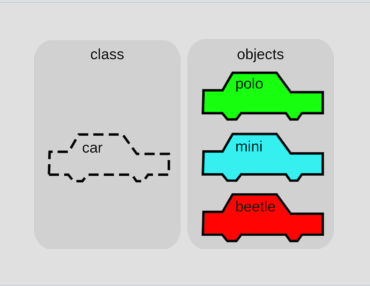
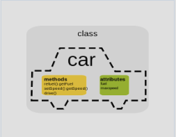
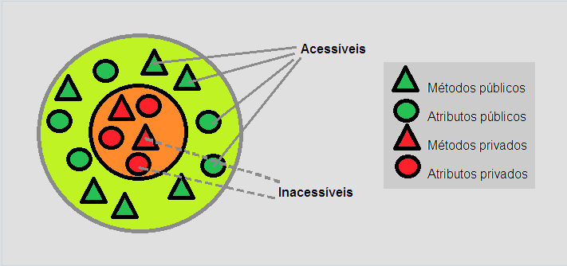
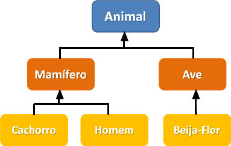

# Introdução à Orientação a Objetos ou OOP (Object-Oriented Programming) ou Modelagem Orientada ao Objeto

## indice

- [Introdução à Orientação a Objetos ou OOP (Object-Oriented Programming) ou Modelagem Orientada ao Objeto](#introdução-à-orientação-a-objetos-ou-oop-object-oriented-programming-ou-modelagem-orientada-ao-objeto)
  - [indice](#indice)
  - [O que é Orientação a Objetos?](#o-que-é-orientação-a-objetos)
  - [O que é um Objeto?](#o-que-é-um-objeto)
  - [O que é uma Classe?](#o-que-é-uma-classe)
    - [O que é um Atributo?](#o-que-é-um-atributo)
    - [O que é um Método?](#o-que-é-um-método)
    - [O que é um Construtor?](#o-que-é-um-construtor)
    - [O que é um Destrutor?](#o-que-é-um-destrutor)
    - [O que é um Modificador de Acesso?](#o-que-é-um-modificador-de-acesso)
    - [O que é um Método Estático?](#o-que-é-um-método-estático)
    - [O que é uma associação?](#o-que-é-uma-associação)
    - [Sobrecarga de métodos](#sobrecarga-de-métodos)
    - [O que é uma interface?](#o-que-é-uma-interface)
    - [O que é Encapsulamento?](#o-que-é-encapsulamento)
    - [O que é Herança?](#o-que-é-herança)
    - [O que é Polimorfismo?](#o-que-é-polimorfismo)
  - [Design Patterns](#design-patterns)
  - [Clean Code e SOLID](#clean-code-e-solid)
  - [Conclusão](#conclusão)
  - [Referências](#referências)
  - [Recomendações](#recomendações)

## O que é Orientação a Objetos?

A Orientação a Objetos ou programação orientada a objetos **(POO)** é um paradigma de programação que utiliza objetos em suas interações, para designar a estrutura de um programa de computador e suas interações. Ela é baseada em várias técnicas, como herança, polimorfismo, abstração e encapsulamento.

Em vez de se concentrar em funções e procedimentos, a Orientação a Objetos se concentra em objetos e suas interações. Isso permite que os programas sejam mais modulares e reutilizáveis, facilitando a manutenção e a evolução do código.

## O que é um Objeto?

Um objeto é uma instância de uma classe. Ele é uma estrutura de dados que contém atributos e métodos. Atributos são as características do objeto, enquanto métodos são as ações que o objeto pode realizar.

Por exemplo, um objeto `Carro` pode ter os atributos `cor`, `modelo` e `ano`, e os métodos `ligar`, `desligar` e `acelerar`.

## O que é uma Classe?

Uma classe é um modelo para a criação de objetos. Ela define os atributos e métodos que os objetos terão. A classe é como um molde, e os objetos são as peças que são feitas a partir desse molde.

Chamamos essa criação de instanciação da classe, como se estivéssemos usando esse molde (classe) para criar um objeto.



Em um exemplo prático, a classe `Carro` pode ter os atributos `cor`, `modelo` e `ano`, e os métodos `ligar`, `desligar` e `acelerar`.

Exemplo de uma classe `Carro` em Java:

```java

public class Carro {
    // Atributos
    private String cor;
    private String modelo;
    private int ano;

    // Métodos
    public void ligar() {
        // código para ligar o carro
    }

    public void desligar() {
        // código para desligar o carro
    }

    public void acelerar() {
        // código para acelerar o carro
    }
}
```

Exemplo de uma classe `Carro` em Python:

```python

class Carro:
    # Atributos
    def __init__(self, cor, modelo, ano):
        self.cor = cor
        self.modelo = modelo
        self.ano = ano

    # Métodos
    def ligar(self):
        # código para ligar o carro

    def desligar(self):
        # código para desligar o carro

    def acelerar(self):
        # código para acelerar o carro
```

Exemplo de uma classe `Carro` em ADVPL/TLPP:

```advpl

Class Carro
    // Atributos
    Data cor as character
    Data modelo as character
    Data ano as integer

    // Métodos
    Method new(cor, modelo, ano) constructor
    Method ligar()
    Method desligar()
    Method acelerar()

EndClass

// Implementação dos métodos
Method new(cor, modelo, ano)
    // código para inicializar os atributos
    Self:cor := cor
    Self:modelo := modelo
    Self:ano := ano
Return

Method ligar()
    // código para ligar o carro
Return

Method desligar()
    // código para desligar o carro
Return

Method acelerar()
    // código para acelerar o carro
Return


```

Aqui, a classe `Carro` define os atributos `cor`, `modelo` e `ano`, e os métodos `ligar`, `desligar` e `acelerar`. Quando um objeto `Carro` é criado, ele terá esses atributos e métodos.

### O que é um Atributo?

Um atributo é uma característica de um objeto. Ele é uma variável que armazena um valor que descreve o objeto. Por exemplo, um objeto `Carro` pode ter os atributos `cor`, `modelo` e `ano`.

### O que é um Método?

Um método é uma ação que um objeto pode realizar. Ele é uma função que opera sobre os atributos do objeto. Por exemplo, um objeto `Carro` pode ter os métodos `ligar`, `desligar` e `acelerar`.

### O que é um Construtor?

Um construtor é um método especial que é chamado quando um objeto é criado. Ele é usado para inicializar os atributos do objeto. O construtor é chamado automaticamente quando um objeto é criado.

Exemplo de um construtor em Java:

```java

public class Carro {
    // Atributos
    private String cor;
    private String modelo;
    private int ano;

    // Construtor
    public Carro(String cor, String modelo, int ano) {
        this.cor = cor;
        this.modelo = modelo;
        this.ano = ano;
    }
}
```

Exemplo de um construtor em Python:

```python

class Carro:
    # Atributos
    def __init__(self, cor, modelo, ano):
        self.cor = cor
        self.modelo = modelo
        self.ano = ano
```

Exemplo de um construtor em ADVPL/TLPP:

```advpl

Class Carro
    // Atributos
    Data cor as character
    Data modelo as character
    Data ano as integer

    Method new(cor, modelo, ano) constructor
EndClass

// Construtor
Method new(cor, modelo, ano)
    // código para inicializar os atributos
    Self:cor := cor
    Self:modelo := modelo
    Self:ano := ano
Return

```

### O que é um Destrutor?

Um destrutor é um método especial que é chamado quando um objeto é destruído. Ele é usado para liberar os recursos que o objeto está usando. O destrutor é chamado automaticamente quando um objeto é destruído.

Exemplo de um destrutor em Java:

```java

public class Carro {
    // Atributos
    private String cor;
    private String modelo;
    private int ano;

    // Destrutor
    protected void finalize() {
        // código para liberar os recursos
    }
}
```

Exemplo de um destrutor em Python:

```python

class Carro:
    # Atributos
    def __del__(self):
        # código para liberar os recursos
```

Exemplo de um destrutor em ADVPL/TLPP:

```advpl

Class Carro
    // Atributos
    Data cor as character
    Data modelo as character
    Data ano as integer

    Method new(cor, modelo, ano) constructor
    Method destroy() destructor

EndClass

// Destrutor
Method destroy()
    // código para liberar os recursos
    // Exemplo: Self:cor := ""
    //          Self:modelo := ""
    //          Self:ano := 0
Return

```

### O que é um Modificador de Acesso?

Um modificador de acesso é uma palavra-chave que é usada para controlar o acesso aos atributos e métodos de uma classe. Existem três tipos de modificadores de acesso: `public`, `protected` e `private`.

- `public`: O atributo ou método pode ser acessado de qualquer lugar.
- `protected`: O atributo ou método pode ser acessado apenas pela classe e suas subclasses.
- `private`: O atributo ou método pode ser acessado apenas pela classe.

### O que é um Método Estático?

Um método estático é um método que pertence à classe, e não a um objeto específico. Ele pode ser chamado sem criar um objeto da classe. Os métodos estáticos são usados para realizar operações que não dependem do estado do objeto.

Por esse motivo, assim como em outras linguagens, os métodos estáticos não acessam as  propriedades da classe, pois não há uma instância ativa.
Por padrão, métodos estáticos são implicitamente públicos.

Exemplo de um método estático em Java:

```java

public class Carro {
    // Atributos
    private String cor;
    private String modelo;
    private int ano;

    // Método estático
    public static void ligarTodos(List<Carro> carros) {
        for (Carro carro : carros) {
            carro.ligar();
        }
    }
}
```

Exemplo de um método estático em Python:

```python

class Carro:
    # Atributos
    def __init__(self, cor, modelo, ano):
        self.cor = cor
        self.modelo = modelo
        self.ano = ano

    # Método estático
    @staticmethod
    def ligar_todos(carros):
        for carro in carros:
            carro.ligar()
```

Exemplo de um método estático em ADVPL/TLPP:

```advpl

  
Class StaticMethod
    public method new()
    static method staticExample()
    public method teste2()
    private data dataI
EndClass
   
   
Method new() class StaticMethod
      
Return Self
  
  
Method staticExample() class StaticMethod
    conout("exemplo")
    /* conout(::dataI) //C9904 Cannot access data nor methods of class from a static method */
    /* conout(::teste2()) //C9904 Cannot access data nor methods of class from a static method */
return
  
Method teste2()  class StaticMethod
return
   
Function U_StaticMethod
  StaticMethod():staticExample()
return
  
```

### O que é uma associação?

Uma associação é um relacionamento entre duas classes. Ela pode ser de vários tipos, como agregação, composição, dependência e associação simples.

- Agregação: Uma classe é composta por outras classes. Por exemplo, uma classe `Carro` pode ser composta por uma classe `Motor`.
- Composição: Uma classe é composta por outras classes, e as classes compostas não podem existir sem a classe principal. Por exemplo, uma classe `Carro` pode ser composta por uma classe `Motor`, e o motor não pode existir sem o carro.
- Dependência: Uma classe depende de outra classe. Por exemplo, uma classe `Carro` pode depender de uma classe `Motor`.
- Associação simples: Uma classe está associada a outra classe. Por exemplo, uma classe `Carro` pode estar associada a uma classe `Motor`.
- Associação bidirecional: Duas classes estão associadas uma à outra. Por exemplo, uma classe `Carro` pode estar associada a uma classe `Motor`, e a classe `Motor` pode estar associada à classe `Carro`.
- Associação unidirecional: Uma classe está associada a outra classe, mas a outra classe não está associada à primeira classe. Por exemplo, uma classe `Carro` pode estar associada a uma classe `Motor`, mas a classe `Motor` não está associada à classe `Carro`.
- Associação reflexiva: Uma classe está associada a si mesma. Por exemplo, uma classe `Pessoa` pode estar associada a uma classe `Pessoa`.
- Associação de cardinalidade: Uma classe está associada a outra classe com uma cardinalidade específica. Por exemplo, uma classe `Carro` pode estar associada a uma classe `Motor` com uma cardinalidade de 1 para 1.

### Sobrecarga de métodos

Sobrecarga de métodos é um recurso que permite que uma classe tenha vários métodos com o mesmo nome, mas com parâmetros diferentes. Isso permite que a classe tenha métodos com comportamentos diferentes, mas com o mesmo nome.

Exemplo de sobrecarga de métodos em Java:

```java

public class Carro {
    // Atributos
    private String cor;
    private String modelo;
    private int ano;

    // Métodos
    public void ligar() {
        // código para ligar o carro
    }

    public void ligar(int voltagem) {
        // código para ligar o carro com uma voltagem específica
    }
}
```

Exemplo de sobrecarga de métodos em Python:

```python

class Carro:
    # Atributos
    def __init__(self, cor, modelo, ano):
        self.cor = cor
        self.modelo = modelo
        self.ano = ano

    # Métodos
    def ligar(self):
        # código para ligar o carro

    def ligar(self, voltagem):
        # código para ligar o carro com uma voltagem específica
```

### O que é uma interface?

Uma interface é um contrato que define um conjunto de métodos que uma classe deve implementar. Ela é usada para definir um comportamento comum para várias classes.

Muitos dos métodos dos carros são comuns em vários automóveis. Tanto um carro quanto uma motocicleta são classes cujos objetos podem acelerar, parar, acender o farol etc, pois são coisas comuns a automóveis. Podemos dizer, então, que ambas as classes "carro" e "motocicleta" são "automóveis".

Quando duas (ou mais) classes possuem comportamentos comuns que podem ser separados em uma outra classe, dizemos que a "classe comum" é uma interface, que pode ser "herdada" pelas outras classes. Note que colocamos a interface como "classe comum", que pode ser "herdada" (com aspas), porque uma interface não é exatamente um classe, mas sim um conjunto de métodos que todas as classes que herdarem dela devem possuir (implementar) - portanto, uma interface não é "herdada" por uma classe, mas sim implementada. No mundo do desenvolvimento de software, dizemos que uma interface é um "contrato": uma classe que implementa uma interface deve fornecer uma implementação a todos os métodos que a interface define, e em compensação, a classe implementadora pode dizer que ela é do tipo da interface. No nosso exemplo, "carro" e "motocicleta" são classes que implementam os métodos da interface "automóvel", logo podemos dizer que qualquer objeto dessas duas primeiras classes, como um Honda Fit ou uma motocicleta da Yamaha, são automóveis.

Um pequeno detalhe: uma interface não pode ser herdada por uma classe, mas sim implementada. No entanto, uma interface pode herdar de outra interface, criando uma hierarquia de interfaces. Usando um exemplo completo com carros, dizemos que a classe "Honda Fit Cross" herda da classe "Honda Fit", que por sua vez herda da classe "Carro". A classe "Carro" implementa a interface "Automóvel" que, por sua vez, pode herdar (por exemplo) uma interface chamada "MeioDeTransporte", uma vez que tanto um "automóvel" quanto uma "carroça" são meios de transporte, ainda que uma carroça não seja um automóvel.

Exemplo de uma interface em Java:

```java

public interface Carro {
    // Métodos
    void ligar();
    void desligar();
    void acelerar();
}
```

Exemplo de uma interface em Python:

```python

class Carro:
    # Métodos
    def ligar(self):
        pass

    def desligar(self):
        pass

    def acelerar(self):
        pass
```

Exemplo de uma interface em ADVPL/TLPP:

```advpl

Interface Carro
    Method ligar()
    Method desligar()
    Method acelerar()
EndInterface

```

### O que é Encapsulamento?

Encapsulamento é um conceito da Orientação a Objetos que permite que os atributos e métodos de um objeto sejam ocultados. Isso significa que o objeto pode controlar o acesso aos seus atributos e métodos, permitindo que ele mantenha seu estado interno consistente.



O encapsulamento é implementado usando modificadores de acesso, como `public`, `protected` e `private`. Isso permite que os atributos e métodos de um objeto sejam acessados apenas por outras classes que tenham permissão para fazê-lo.



O encapsulamento é uma técnica que permite que os objetos sejam tratados como caixas pretas, ocultando os detalhes internos de sua implementação. Isso permite que os objetos sejam mais fáceis de usar e de manter, e evita que o código dependa de detalhes internos que podem mudar.

Exemplo de encapsulamento em Java:

```java

public class Carro {
    // Atributos
    private String cor;
    private String modelo;
    private int ano;

    // Métodos
    public String getCor() {
        return cor;
    }

    public void setCor(String cor) {
        this.cor = cor;
    }

    public String getModelo() {
        return modelo;
    }

    public void setModelo(String modelo) {
        this.modelo = modelo;
    }

    public int getAno() {
        return ano;
    }

    public void setAno(int ano) {
        this.ano = ano;
    }
}
```

Exemplo de encapsulamento em Python:

```python

class Carro:
    # Atributos
    def __init__(self, cor, modelo, ano):
        self.__cor = cor
        self.__modelo = modelo
        self.__ano = ano

    # Métodos
    def get_cor(self):
        return self.__cor

    def set_cor(self, cor):
        self.__cor = cor

    def get_modelo(self):
        return self.__modelo

    def set_modelo(self, modelo):
        self.__modelo = modelo

    def get_ano(self):
        return self.__ano

    def set_ano(self, ano):
        self.__ano = ano
```

Exemplo de encapsulamento em ADVPL/TLPP:

```advpl

Class Carro
    // Atributos
    Data cor as character
    Data modelo as character
    Data ano as integer

    // Métodos
    Method getCor()
    Method setCor(cor)
    Method getModelo()
    Method setModelo(modelo)
    Method getAno()
    Method setAno(ano)
EndClass

// Implementação dos métodos
Method getCor()
    Return Self:cor
Return

Method setCor(cor)
    Self:cor := cor
Return

Method getModelo()
    Return Self:modelo
Return

Method setModelo(modelo)
    Self:modelo := modelo
Return

Method getAno()
    Return Self:ano
Return

Method setAno(ano)
    Self:ano := ano
Return

```

Conforme os exemplos acima, os atributos `cor`, `modelo` e `ano` são privados, e os métodos `getCor`, `setCor`, `getModelo`, `setModelo`, `getAno` e `setAno` são públicos. Isso permite que os atributos sejam acessados e modificados apenas pelos métodos da classe, garantindo que o estado interno do objeto seja consistente.

### O que é Herança?

Herança é um conceito da Orientação a Objetos que permite que uma classe herde atributos e métodos de outra classe. Isso permite que as classes compartilhem código e comportamento, evitando a duplicação de código.



No nosso exemplo, você acabou de comprar um carro com os atributos que procurava. Apesar de ser único, existem carros com exatamente os mesmos atributos ou formas modificadas. Digamos que você tenha comprado o modelo Fit, da Honda. Esse modelo possui uma outra versão, chamada WR-V (ou "Honda Fit Cross Style"), que possui muitos dos atributos da versão clássica, mas com algumas diferenças bem grandes para transitar em estradas de terra: o motor é híbrido (aceita álcool e gasolina), possui um sistema de suspensão diferente, e vamos supor que além disso ele tenha um sistema de tração diferente (tração nas quatro rodas, por exemplo). Vemos então que não só alguns atributos como também alguns mecanismos (ou métodos, traduzindo para POO) mudam, mas essa versão "cross" ainda é do modelo Honda Fit, ou melhor, é um tipo do modelo.

Quando dizemos que uma classe A é um tipo de classe B, dizemos que a classe A herda as características da classe B e que a classe B é mãe da classe A, estabelecendo então uma relação de **herança** entre elas. No caso do carro, dizemos então que um Honda Fit "Cross" é um tipo de Honda Fit, e o que muda são alguns atributos (para-lama reforçado, altura da suspensão etc), e um dos métodos da classe (acelerar, pois agora há tração nas quatro rodas), mas todo o resto permanece o mesmo, e o novo modelo recebe os mesmos atributos e métodos do modelo clássico.

Exemplo de herança em Java:

```java

public class Carro {
    // Atributos
    private String cor;
    private String modelo;
    private int ano;

    // Métodos
    public void ligar() {
        // código para ligar o carro
    }

    public void desligar() {
        // código para desligar o carro
    }

    public void acelerar() {
        // código para acelerar o carro
    }
}

// "extends" estabelece a relação de herança dom a classe Carro
public class CarroCross extends Carro {
    // Atributos
    private boolean tracaoNasQuatroRodas;

    // Métodos
    public void acelerar() {
        // código para acelerar o carro com tração nas quatro rodas
    }
}
```

Exemplo de herança em Python:

```python

class Carro:
    # Atributos
    def __init__(self, cor, modelo, ano):
        self.cor = cor
        self.modelo = modelo
        self.ano = ano

    # Métodos
    def ligar(self):
        # código para ligar o carro

    def desligar(self):
        # código para desligar o carro

    def acelerar(self):
        # código para acelerar o carro

# As classes dentro do parênteses são as classes mãe da classe sendo definida
class CarroCross(Carro):

    # Atributos
    def __init__(self, cor, modelo, ano, tracaoNasQuatroRodas):
        super().__init__(cor, modelo, ano)
        self.tracaoNasQuatroRodas = tracaoNasQuatroRodas

    # Métodos
    def acelerar(self):
        # código para acelerar o carro com tração nas quatro rodas
```

Exemplo de herança em ADVPL/TLPP:

```advpl

Class Carro
    // Atributos
    Data cor as character
    Data modelo as character
    Data ano as integer

    // Métodos
    Method ligar()
    Method desligar()
    Method acelerar()

EndClass

// Utiliza-se a palavra reservada "From" para definir uma nova herança de classes.
Class CarroCross from Carro
    // Atributos
    Data tracaoNasQuatroRodas as logical

    // Métodos
    Method acelerar()

EndClass

// Implementação dos métodos

Method acelerar()
    // código para acelerar o carro com tração nas quatro rodas
Return

```

### O que é Polimorfismo?

Polimorfismo é um conceito da Orientação a Objetos que permite que um objeto seja tratado de várias formas. Isso significa que um objeto pode ser tratado como um objeto de sua classe base, ou como um objeto de uma classe derivada.

Vamos dizer que um dos motivos de você ter comprado um carro foi a qualidade do sistema de som dele. Mas, no seu caso, digamos que a reprodução só pode ser feita via rádio ou bluetooth, enquanto que no seu antigo carro, podia ser feita apenas via cartão SD e pendrive. Em ambos os carros está presente o método "tocar música" mas, como o sistema de som deles é diferente, a forma como o carro toca as músicas é diferente. Dizemos que o método "tocar música" é uma forma de polimorfismo, pois dois objetos, de duas classes diferentes, têm um mesmo método que é implementado de formas diferentes, ou seja, um método possui várias formas, várias implementações diferentes em classes diferentes, mas que possuem o mesmo efeito **("polimorfismo" vem do grego poli = muitas, morphos = forma)**.

Exemplo de polimorfismo em Java:

```java
public class Main {
    public static void main(String[] args) {

        Automovel moto = new Moto("Yamaha XPTO-100", new MecanismoDeAceleracaoDeMotos())
        
        Automovel carro = new Carro("Honda Fit", new MecanismoDeAceleracaoDeCarros())
        
        List<Automovel> listaAutomoveis = Arrays.asList(moto, carro);
        
        for (Automovel automovel : listaAutomoveis) {
            automovel.acelerar();
            automovel.acenderFarol();
        }
    }
}

```

Exemplo de polimorfismo em Python:

```python

def main():
    moto = Moto("Yahama XPTO-100", MecanismoDeAceleracaoDeMotos())
    carro = Carro("Honda Fit", MecanismoDeAceleracaoDeCarros())
    listaAutomoveis = [moto, carro]
    for automovel in listaAutomoveis:
        automovel.acelerar()
        automovel.acenderFarol()
```

Repare que apesar de serem objetos diferentes, moto e carro possuem os mesmos métodos acelerar e acenderFarol, que são chamados da mesma forma, apesar de serem implementados de maneira diferente.

## Design Patterns

Design Patterns são soluções para problemas comuns que surgem durante o desenvolvimento de software. Eles são padrões de projeto que podem ser usados para resolver problemas de design de software de forma eficiente e reutilizável.

Existem vários tipos de Design Patterns, como padrões de criação, padrões estruturais e padrões comportamentais. Cada tipo de Design Pattern resolve um tipo específico de problema, como a criação de objetos, a composição de objetos e a interação entre objetos.

Alguns problemas aparecem com tanta frequência em POO que suas soluções se tornaram padrões de design de sistemas e modelagem de código orientado a objeto, a fim de resolvê-los. [Esses padrões de projeto, (ou design patterns)](https://www.alura.com.br/artigos/design-patterns-introducao-padroes-projeto) nada mais são do que formas padronizadas de resolver problemas comuns em linguagens orientadas a objetos. O livro "Design Patterns", conhecido como Gof:Gang of Four, é a principal referência nesse assunto, contendo os principais padrões usados em grandes projetos. A Alura também oferece cursos de Design Patterns em linguagens de programação como [Java](https://www.alura.com.br/curso-online-design-patterns), [Python](https://www.alura.com.br/curso-online-design-patterns-python) e [C#](https://www.alura.com.br/curso-online-design-patterns-dotnet).

## Clean Code e SOLID

Em projetos desenvolvidos com POO, assim como em qualquer outro, o código pode se tornar desorganizado e difícil de manter a médio e longo prazo. Em vista dessa situação, alguns princípios de boas práticas de programação e código limpo foram desenvolvidos como, por exemplo:

Clean Code é um conceito que preza pela legibilidade e manutenibilidade do código. Ele é baseado em vários princípios, como a clareza, a simplicidade, a consistência e a modularidade. O Clean Code é importante porque torna o código mais fácil de entender, de manter e de evoluir.

SOLID é um acrônimo que representa cinco princípios da Orientação a Objetos: Single Responsibility Principle, Open/Closed Principle, Liskov Substitution Principle, Interface Segregation Principle e Dependency Inversion Principle. Esses princípios são importantes porque ajudam a criar código mais modular, reutilizável e flexível.

- KISS (Keep It Simple, Stupid) - Mantenha-o simples:  Sempre que um código for escrito, ele deve ser escrito da forma mais simples possível, para manter o código mais legível. Códigos complexos demais são mais difíceis de se manter, j que é mais difícil entender o que ele faz e como ele faz.
- DRY (Don't Repeat Yourself) - Não se repita:   Todo código escrito para resolver um problema deve ser escrito apenas uma vez, a fim de evitar repetição de código. É quase uma variação do KISS, dado que a repetição de código o torna mais confuso e difícil de manter e corrigir, se necessário.

## Conclusão

A Orientação a Objetos é um paradigma de programação poderoso e flexível, que permite a criação de programas complexos e de fácil manutenção. Ela é baseada em vários conceitos, como **herança**, polimorfismo, abstração e encapsulamento, que permitem a criação de programas modulares e reutilizáveis.

## Referências

[POO: o que é programação orientada a objetos?](https://www.alura.com.br/artigos/poo-programacao-orientada-a-objetos)

## Recomendações

[Design Patterns: o que são e como funcionam?](https://www.alura.com.br/artigos/design-patterns-introducao-padroes-projeto)
[Curso de Design Patterns](https://www.alura.com.br/artigos/como-nao-aprender-orientacao-a-objetos-heranca)
[Como não aprender Java e Orientação a Objetos: getters e setters](https://www.alura.com.br/artigos/nao-aprender-oo-getters-e-setters)
[Clean Code: O que é, Casos de Uso, Exemplo de Código Limpo](https://www.alura.com.br/artigos/o-que-e-clean-code)
[TLPP - Recursos de Linguagem - Classes](https://tdn.totvs.com/display/tec/Classes)