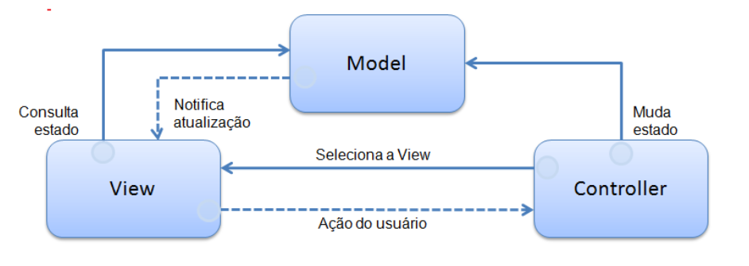

# Model View Controller (MVC)

## Sumário

- [Model View Controller (MVC)](#model-view-controller-mvc)
  - [Sumário](#sumário)
  - [Introdução](#introdução)
  - [Estrutura](#estrutura)
    - [Controller (Controlador) ou Camada de Controle](#controller-controlador-ou-camada-de-controle)
    - [Model (Modelo) ou Camada de Dados](#model-modelo-ou-camada-de-dados)
    - [View (Visualização) ou Camada de Apresentação](#view-visualização-ou-camada-de-apresentação)
  - [Onde o MVC é utilizado?](#onde-o-mvc-é-utilizado)
    - [Vantagens do MVC](#vantagens-do-mvc)
    - [Desvantagens do MVC](#desvantagens-do-mvc)
  - [Model View Controller (MVC) em ADVPL](#model-view-controller-mvc-em-advpl)
    - [Principais funções da aplicação em AdvPL utilizando o MVC](#principais-funções-da-aplicação-em-advpl-utilizando-o-mvc)
      - [O que é a função ModelDef?](#o-que-é-a-função-modeldef)
      - [O que é a função ViewDef?](#o-que-é-a-função-viewdef)
      - [O que é a função MenuDef?](#o-que-é-a-função-menudef)
    - [Manual MVC em AdvPL](#manual-mvc-em-advpl)
    - [Exemplo de aplicação em MVC](#exemplo-de-aplicação-em-mvc)
  - [Referências](#referências)

## Introdução

O padrão de arquitetura de software Model-View-Controller (MVC) é um padrão de projeto de software que separa a representação da informação da interação do usuário com ela. O padrão é composto por três camadas principais: Model, View e Controller.

## Estrutura

O padrão MVC é composto por três camadas principais: Model, View e Controller.



### Controller (Controlador) ou Camada de Controle

O controlador é a camada intermediária entre a visualização e o modelo. Ele é responsável por receber os comandos do usuário, como cliques em botões, e enviar esses comandos para o modelo. O controlador também é responsável por receber os dados do modelo e enviá-los para a visualização.

### Model (Modelo) ou Camada de Dados

O modelo é a representação dos dados e das regras de negócio. Ele é responsável por gerenciar os dados, lógica de negócio e regras de dados. O modelo é a camada mais próxima do banco de dados.

### View (Visualização) ou Camada de Apresentação

A visualização é a camada de apresentação. Ela é responsável por exibir os dados ao usuário e também por enviar comandos do usuário para o controlador.

## Onde o MVC é utilizado?

O padrão MVC é amplamente utilizado em aplicações web, como sites e aplicativos web. Ele é uma forma eficaz de organizar o código e separar as responsabilidades entre as diferentes partes de uma aplicação.

Um caso prático é uma aplicação web em que a visão é um documento HTML (ou derivado) gerado pela aplicação. O controlador recebe uma entrada GET ou POST após um estímulo do utilizador e decide como processá-la, invocando objetos do domínio para tratar a lógica de negócio, e por fim invocando uma visão para apresentar a saída

### Vantagens do MVC

- Separação de responsabilidades: O MVC separa as responsabilidades entre as diferentes partes de uma aplicação, facilitando a manutenção e o desenvolvimento.
- Reutilização de código: O MVC permite a reutilização de código, pois as diferentes partes da aplicação são independentes umas das outras.
- Facilidade de teste: O MVC facilita o teste das diferentes partes da aplicação, pois cada parte pode ser testada separadamente.
- Flexibilidade: O MVC é um padrão flexível que pode ser adaptado para diferentes tipos de aplicações.
- Escalabilidade: O MVC é um padrão escalável que pode ser utilizado em aplicações de diferentes tamanhos e complexidades.
- Facilidade de manutenção: O MVC facilita a manutenção da aplicação, pois as diferentes partes da aplicação são independentes umas das outras.
- Facilidade de desenvolvimento: O MVC facilita o desenvolvimento da aplicação, pois as diferentes partes da aplicação são independentes umas das outras.
- Facilidade de compreensão: O MVC facilita a compreensão da aplicação, pois as diferentes partes da aplicação são independentes umas das outras.
- Facilidade de colaboração: O MVC facilita a colaboração entre os desenvolvedores, pois as diferentes partes da aplicação são independentes umas das outras.

### Desvantagens do MVC

- Complexidade: O MVC pode ser complexo para desenvolvedores inexperientes.
- Necessita de um bom planejamento: O MVC necessita de um bom planejamento para ser implementado corretamente.

## Model View Controller (MVC) em ADVPL

Para facilitar e agilizar o desenvolvimento, na implementação do MVC feita no AdvPL, o desenvolvedor 
trabalhará com as definições de Modelo de dados (Model) e View, a parte responsável pelo Controller já está
intrínseca.

### Principais funções da aplicação em AdvPL utilizando o MVC

Os desenvolvedores em suas aplicações serão responsáveis por definir as seguintes funções:

- ``ModelDef``: Contém a construção e a definição do Model, lembrando que o Modelo de dados 
(Model) contém as regras de negócio;
- ``ViewDef``: Contém a construção e definição da View, ou seja, será a construção da interface;
- ``MenuDef``: Contém a definição das operações disponíveis para o modelo de dados (Model).

Cada fonte em MVC (PRW) só pode conter uma de cada dessas funções. Só pode ter uma ModelDef, uma ViewDef e uma MenuDef. Ao se fazer uma aplicação em AdvPL utilizando MVC, automaticamente ao final, está aplicação já terá disponível.

- Pontos de Entradas já disponíveis;
- Um Web Service para sua utilização;
- Importação ou exportação mensagens XML.

#### O que é a função ModelDef?

A função ModelDef define a regra de negócios propriamente dita onde são definidas

- Todas as entidades (tabelas) que farão parte do modelo de dados (Model);
- Regras de dependência entre as entidades;
- Validações (de campos e aplicação);
- Persistência dos dados (gravação).

Para uma ModelDef não é preciso necessariamente possuir uma interface. Como a regra de negócios é totalmente separada da interface no MVC, podemos utilizar a ModelDef em qualquer outra aplicação, ou até utilizarmos uma determinada ModelDef como base para outra mais complexa.

As entidades da ModelDef não se baseiam necessariamente em metadados (dicionários). Como veremos mais à frente, ela se baseia em estruturas e essas por sua vez é que podem vir do metadados ou serem construídas manualmente. A ModelDef deve ser uma Static Function dentro da aplicação.

#### O que é a função ViewDef?

A função ViewDef define como o será a interface e portanto como o usuário interage com o modelo de dados (Model) recebendo os dados informados pelo usuário, fornecendo ao modelo de dados (definido na ModelDef) e apresentando o resultado. A interface pode ser baseada totalmente ou parcialmente em um metadado (dicionário), permitindo:

- Reaproveitamento do código da interface, pois uma interface básica pode ser acrescida de novos componentes;
- Simplicidade no desenvolvimento de interfaces complexas. Um exemplo disso são aquelas aplicações onde uma GRID depende de outra. No MVC a construção de aplicações que tem GRIDs dependentes é extremamente fácil;
- Agilidade no desenvolvimento, a criação e a manutenção se tornam muito mais ágeis;
- Mais de uma interface por Business Object. Poderemos ter interfaces diferentes para cada variação de um segmento de mercado, como o varejo.
- A ViewDef deve ser uma Static Function dentro da aplicação.

#### O que é a função MenuDef?

Uma função MenuDef define as operações quer serão realizadas pela aplicação, tais como inclusão, alteração, exclusão, etc.

Deve retornar um array em um formato específico com as seguintes informações:

- Título
- Nome da aplicação associada
- Reservado;
- Tipo de Transação a ser efetuada.

E que podem ser:

- ``1`` - para Pesquisar
- ``2`` - para Visualizar
- ``3`` - para Incluir
- ``4`` - para Alterar
- ``5`` - para Excluir
- ``6`` - para Imprimir
- ``7`` - para Copiar
- ``5`` - Nível de acesso;
- ``6`` - Habilita Menu Funcional;

Exemplo de um MenuDef:

```advpl

Static Function MenuDef()

    Local aRotina := {}

    aAdd( aRotina, { 'Visualizar', 'VIEWDEF.COMP021_MVC', 0, 2, 0, NIL } )
    aAdd( aRotina, { 'Incluir' , 'VIEWDEF.COMP021_MVC', 0, 3, 0, NIL } )
    aAdd( aRotina, { 'Alterar' , 'VIEWDEF.COMP021_MVC', 0, 4, 0, NIL } )
    aAdd( aRotina, { 'Excluir' , 'VIEWDEF.COMP021_MVC', 0, 5, 0, NIL } )
    aAdd( aRotina, { 'Imprimir' , 'VIEWDEF.COMP021_MVC', 0, 8, 0, NIL } )
    aAdd( aRotina, { 'Copiar' , 'VIEWDEF.COMP021_MVC', 0, 9, 0, NIL } )

Return aRotina

// O primeiro parâmetro é Título, o segundo é a aplicação associada, o terceiro é reservado, o quarto é o tipo de transação, o quinto é o nível de acesso.

```

Note que o 2º parâmetro utiliza a chamada direta de uma aplicação, ela faz referência a uma ``ViewDef`` de um determinado fonte (PRW). A estrutura deste 2º parâmetro tem o formato:

```advpl

    ViewDef.<nome do fonte>

```

Sempre referenciaremos a ViewDef de um fonte, pois ela é a função responsável pela a interface da aplicação.

Para facilitar o desenvolvimento, no MVC a MenuDef escreva-a da seguinte forma:

```advpl

Static Function MenuDef()
    Local aRotina := {}

    ADD OPTION aRotina Title 'Visualizar'   Action 'VIEWDEF.COMP021_MVC' OPERATION 2 ACCESS 0
    ADD OPTION aRotina Title 'Incluir'      Action 'VIEWDEF.COMP021_MVC' OPERATION 3 ACCESS 0
    ADD OPTION aRotina Title 'Alterar'      Action 'VIEWDEF.COMP021_MVC' OPERATION 4 ACCESS 0
    ADD OPTION aRotina Title 'Excluir'      Action 'VIEWDEF.COMP021_MVC' OPERATION 5 ACCESS 0
    ADD OPTION aRotina Title 'Imprimir'     Action 'VIEWDEF.COMP021_MVC' OPERATION 8 ACCESS 0
    ADD OPTION aRotina Title 'Copiar'       Action 'VIEWDEF.COMP021_MVC' OPERATION 9 ACCESS 0

Return aRotina

// O primeiro parâmetro é Título, o segundo é a aplicação associada, o terceiro é reservado, o quarto é o tipo de transação, o quinto é o nível de acesso.

```

O resultado final é o mesmo, o que difere é apenas a forma de construção, mas é recomendado a 2ª forma que utiliza o formato de comandos e não posições de um vetor, pois uma eventual manutenção se tornará mais fácil. A MenuDef deve ser uma Static Function dentro da aplicação. Utilizando-se a função FWMVCMenu, obtêm-se um menu padrão com as opções: Visualizar, Incluir, Alterar, Excluir, Imprimir e Copiar.

Deve ser informado como parâmetro no nome do fonte.

Exemplo:

```advpl

Static Function MenuDef()
Return FWMVCMenu( "COMP021_MVC" )
    
```

Isso criaria um Menudef exatamente como o exemplo anterior.
Para mais detalhes veja o capítulo 12.7 Obter um menu padrão (FWMVCMenu).

### Manual MVC em AdvPL

- [MVC em AdvPL](https://tdn.totvs.com/display/public/framework/AdvPl+utilizando+MVC)
- [MVC em AdvPL V1](manual_mvc/AdvPL%20utilizando%20MVC%20v1%200%20-%20Português.xps)
- [MVC em AdvPL V2](manual_mvc/AdvPL%20utilizando%20MVC%20v2%20-%20POR.pdf)

### Exemplo de aplicação em MVC

[Exemplos MVC](https://tdn.totvs.com/display/public/framework/Exemplos+MVC)

Os exemplos assumem que as tabelas e campos estejam criadas conforme o documento Relação de [Tabelas Z](Exemplos_MVC/Tabelas%20Z.doc). Confira a necessidade de criação de campos para cada fonte .

|Descrição|Fonte|
|---|---|
|Cadastro simples|[COMP011_MVC.prw](Exemplos_MVC/COMP011_MVC.prw)|
|Cadastro simples com adição de campos manualmente na estrutura de dados|[COMP013_MVC.prw](Exemplos_MVC/COMP013_MVC.prw)|
|Cadastro simples utilizando model e view já existentes|[COMP015_MVC.prw](Exemplos_MVC/COMP015_MVC.prw)|
|Cadastro pai/filho|[COMP021_MVC.prw](Exemplos_MVC/COMP021_MVC.prw)|
|Cadastro pai/filho com gráfico na view|[COMP021G_MVC.prw](Exemplos_MVC/COMP021G_MVC.prw)|
|Cadastro pai/filho com adição de botão extra na barra de botões|[COMP021V_MVC.prw](Exemplos_MVC/COMP021V_MVC.prw)|
|Cadastro pai/filho em MVC com estrutura de calculo, interceptacao da gravacao dos dados (COMMIT) e folders|[COMP022_MVC.prw](Exemplos_MVC/COMP022_MVC.prw)|
|Cadastro pai/filho/neto|[COMP023_MVC.prw](Exemplos_MVC/COMP023_MVC.prw)|
|Cadastro pai/filho/neto com múltiplos browses|[COMP024_MVC.prw](Exemplos_MVC/COMP024_MVC.prw)|
|Cadastro pai/filho/neto com múltiplos browses|[COMP024A_MVC.prw](Exemplos_MVC/COMP024A_MVC.prw)|
|Cadastro simples com marcação no browse e processamento|[COMP025_MVC.prw](Exemplos_MVC/COMP025_MVC.prw)|
|Cadastro pai/filho com campos manualmente e campo de marcação no formulário|[COMP026_MVC.prw](Exemplos_MVC/COMP026_MVC.prw)|
|Cadastro pai/filho/neto usando usando arvore|[COMP027_MVC.prw](Exemplos_MVC/COMP027_MVC.prw)|
|Tela de consulta MVC|[COMP029_MVC.prw](Exemplos_MVC/COMP029_MVC.prw)|
|Importação de Dados para cadastro simples|[COMP031_MVC.prw](Exemplos_MVC/COMP031_MVC.prw)|
|Importação de dados para cadastro pai/filho|[COMP032_MVC.prw](Exemplos_MVC/COMP032_MVC.prw)|
|Cadastro simples usando sintaxe NEW MODEL 1|[COMP041_MVC.prw](Exemplos_MVC/COMP041_MVC.prw)|
|Cadastro tabela não normalizada usando sintaxe NEW MODEL|[COMP042_MVC.prw](Exemplos_MVC/COMP042_MVC.prw)|
|Cadastro pai/filho usando sintaxe NEW MODEL|[COMP043_MVC.prw](Exemplos_MVC/COMP043_MVC.prw)|
|Cadastro simples usando sintaxe NEW MODEL e menudef|[COMP044_MVC.prw](Exemplos_MVC/COMP044_MVC.prw)|
|Exemplo de utilização dos pontos de entrada MVC|[COMPPONTOS.prw](Exemplos_MVC/COMPPONTOS.prw)|
|Exemplo de MVC somente com GRID|[COMP045_MVC.prw](Exemplos_MVC/COMP045_MVC.prw)|

## Referências

- [MVC - Wikipedia](https://pt.wikipedia.org/wiki/MVC)
- [MVC em AdvPL V2](manual_mvc/AdvPL%20utilizando%20MVC%20v2%20-%20POR.pdf)