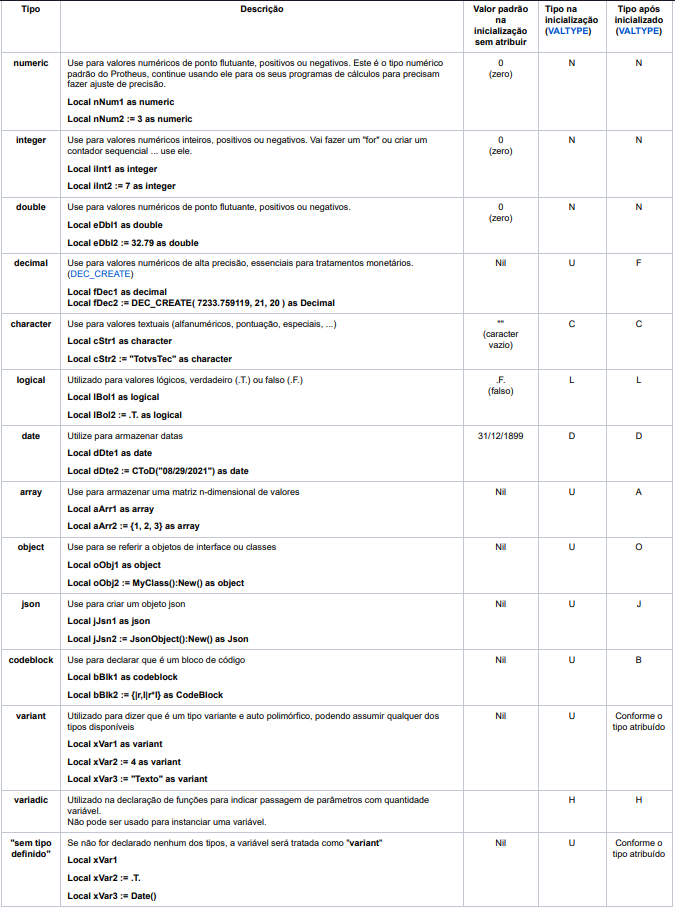

# Tipos de dados

Podemos definir um tipo de dado como um conjunto de valores e operações que podem ser realizadas com esses valores. Os tipos de dados são utilizados para definir o tipo de dado que será armazenado em uma variável.

Por exemplo, podemos definir seres humanos como um tipo de dado que possui os valores "nome", "idade" e "sexo". Podemos realizar operações com esses valores, como por exemplo, calcular a idade de uma pessoa.

Exemplo de variável do tipo ser humano:

| Descrição | Dado | Tipo do dado |
| --- | --- | --- |
| Nome | João | String |
| Idade | 20 | Inteiro |
| Sexo | Masculino | String |

## Tipos inteiros

São caracterizados como tipos inteiros, os dados numéricos positivos ou negativos, excluindo-se destes qualquer número fracionário. Como exemplo deste tipo de dado, tem-se os valores: 35, 0, -56, 1024 entre outros.

Exemplo de variável do tipo inteiro:

| Descrição | Dado | Tipo do dado |
| --- | --- | --- |
| Idade | 20 | Inteiro |

## Tipos reais

São caracterizados como tipos reais, aqueles que possuem parte decimal ou são 
números fracionários, e podem ser positivos, negativos ou zero. Exemplos de 
dados do tipo real são 3.2 (real positivo), 0.00 (zero real) e -19.76 (real negativo).

Exemplo de variável do tipo real:

| Descrição | Dado | Tipo do dado |
| --- | --- | --- |
| Altura | 1.80 | Real |

## Tipos Caractere

São caracterizados como tipos caracteres, as sequências contendo letras, números e símbolos especiais. Uma sequência de caracteres deve ser indicada entre aspas (“”). Este tipo de dado também é conhecido como alfanumérico, string, literal ou cadeia. Como exemplo deste tipo de dado, tem-se os valores: “Programação”, “Rua Alfa, 52 Apto 1”, “Fone 574-9988”, “04387- 
030”, “ ”, “7” entre outros.

Exemplo de variável do tipo caractere:

| Descrição | Dado | Tipo do dado |
| --- | --- | --- |
| Nome | João | String |

## Tipos lógicos

São caracterizados como tipos lógicos os dados com valor verdadeiro e falso, sendo que este tipo de dado poderá representar apenas um dos dois valores. Ele é chamado por alguns de tipo booleano, devido à contribuição do filósofo e matemático inglês George Boole na área da lógica matemática.

Exemplo de variável do tipo lógico:

| Descrição | Dado | Tipo do dado |
| --- | --- | --- |
| Aprovado | True | Lógico |
| Reprovado | False | Lógico |


### Tipos de dados primitivos

Os tipos de dados primitivos são os tipos de dados que já estão definidos na linguagem de programação.

#### Tipos de dados do ADVPL

| Tipo de dado | Descrição | Indicador |Exemplo |
| --- | --- | --- | --- |
| numeric | Armazena um número | N | 1 |
| char / character | Armazena um caractere | C | "A" |
| date | Armazena uma data | D | CTOD("01/01/2019") |
| block / codeblock | Armazena um bloco de código | B | { || ... } |
| logical | Armazena um valor lógico | L | .T. |
| Array | Armazena um array | A | { || ... } |
| object | Armazena um objeto | O | { || ... } |
| variadic | Armazena um número variável de parâmetros | V | { || ... } |


#### Tipos de dados do TlPP



#### Tipos de dados python

| Tipo de dado | Descrição | Indicador |Exemplo |
| --- | --- | --- | --- |
| int | Armazena um número inteiro | N | 1 |
| float | Armazena um número decimal | N | 1.0 |
| str | Armazena uma string | C | "A" |
| bool | Armazena um valor lógico | L | True |
| list | Armazena uma lista | A | [1,2,3] |
| tuple | Armazena uma tupla | A | (1,2,3) |
| dict | Armazena um dicionário | O | {1:2, 3:4} |
| complex | Armazena um número complexo | N | 1+2j |


### Tipos de dados primitivos e não primitivos

Vamos usar o JavaScript como exemplo, pois é uma linguagem de programação que possui tipos de dados primitivos e não primitivos.

Em JavaScript, existem seis tipos de dados primitivos:

- Números
- Strings
- Booleanos
- Booleanos
- Null
- Undefined

Os tipos de dados primitivos são os tipos de dados básicos que são usados na linguagem JavaScript. Eles são armazenados na memória como valores, e não como referências. Isso significa que quando você atribui um valor primitivo a uma variável, a variável realmente armazena o valor, e não uma referência para o valor.

Os tipos de dados não primitivos, por outro lado, são armazenados na memória como referências. Isso significa que quando você atribui um valor não primitivo a uma variável, a variável realmente armazena uma referência para o valor, e não o valor em si.

Os tipos de dados não primitivos incluem:

- Objetos
- Funções
- Arrays

Os objetos são um tipo de dados complexo que pode armazenar uma variedade de valores, incluindo outros objetos, strings, números e booleanos. As funções são um tipo de dados que podem ser usadas para executar código. Os arrays são um tipo de dados que podem armazenar uma coleção de valores, e cada valor pode ser de um tipo diferente.

Aqui estão alguns exemplos de como os tipos de dados primitivos e não primitivos são usados em JavaScript:

```JavaScript
// Exemplo de um tipo de dados primitivo
let myNumber = 10;

// Exemplo de um tipo de dados primitivo

let myString = "Hello World";

// Exemplo de um tipo de dados não primitivo
let myObject = {
  "name": "John Doe",
  "age": 30

// Exemplo de tipo de dado não primitivo
let aproveitamento = {
    "nome": "João",
    "idade": 20,
    "notas": [10, 9, 8, 7]
};

```

No primeiro exemplo, a variável myNumber armazena o valor inteiro 10. No terceiro exemplo, a variável myObject armazena um objeto que tem duas propriedades: name e age. A propriedade name tem o valor John Doe e a propriedade age tem o valor 30.

## Referências

- [Tipos de Dados](https://tdn.totvs.com/display/tec/Tipagem+de+Dados#TipagemdeDados-3.TiposdeDados)
- [Tipos Nativos TLPP](https://tdn.totvs.com/display/tec/Tipos+Nativos)
- [Tipos De Variáveis Disponíveis No Python](https://pythonacademy.com.br/blog/tipos-de-variaveis-no-python)
- [JavaScript data types and data structures](https://developer.mozilla.org/en-US/docs/Web/JavaScript/Data_structures)
- [Classificação das Estruturas de Dados - Primitivas e Não primitivas](https://www.youtube.com/watch?v=XDgOANkoS0Q)