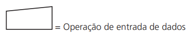
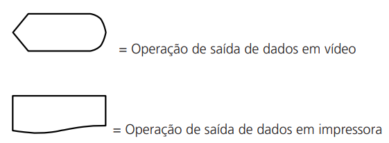
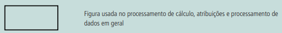
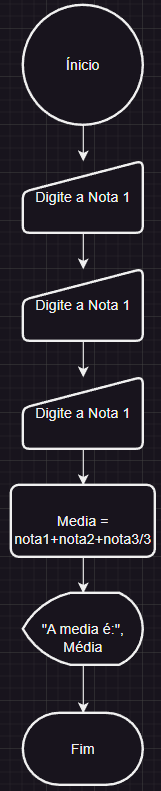

# Introdução a instruções primitivas

Como o próprio nome diz, instruções primitivas são os comandos básicos que efetuam tarefas essenciais para a operação dos computadores, como entrada e saída de dados (comunicação com o usuário e com dispositivos periféricos), e movimentação dos mesmos na memória.

Para entendermos a definição das instruções primitivas, precisamos definir alguns termos:

- Dispositivo de entrada é o meio pelo qual as informações (mais especificamente os dados) são transferidas pelo usuário ou pelos níveis secundários de memória ao computador. Os exemplos mais comuns são o teclado, o mouse, leitora ótica, leitora de código de barras, as fitas e discos magnéticos.
- Dispositivo de saída é o meio pelo qual as informações (geralmente os resultados da execução de um programa) são transferidas pelo computador ao usuário ou aos níveis secundários de memória. Os exemplos mais comuns são o monitor de vídeo, impressora, fitas e discos magnéticos.
- Sintaxe é a forma como os comandos devem ser escritos, a fim de que possam ser entendidos pelo tradutor de programas. A violação das regras sintáticas é considerada um erro sujeito à pena do não reconhecimento por parte do tradutor.
- Semântica é o significado, ou seja, o conjunto de ações que serão exercidas pelo computador durante a execução do referido comando.

As instruções de uma linguagem de programação sempre serão executadas em sequência. Portanto, podemos considerar o processo de construção de um algoritmo como o encadeamento de instruções individuais que, em seu conjunto, formarão o algoritmo.

## Blocos de instruções

A utilização de blocos de instruções deixa claro onde a sequência de instruções inicia e termina. Um bloco apresenta o início e o término do conjunto de instruções que serão executadas em sequência. Todo o algoritmo tem pelo menos um bloco de instruções, que indica o início e o final do próprio algoritmo. O bloco de instruções é construído como se segue:

``` pseudocode

< declaração de variáveis >

INÍCIO
    < instrução 1 >
    < instrução 2 >
    ...
    < instrução n >

FIM

```

Se juntarmos as instruções e a declaração de variáveis e constantes que já apresentamos, formaremos um código válido: Exemplo:

``` pseudocode

CONST maximo = 100;
VAR
 quantidade, filhos, netos : inteiro;
 aberto : booleano;
 altura : real;
 resposta : caracter;
INICIO
 altura ← 1.80;
 filhos ← 3;
 netos ← filhos * 2 – 3;
 quantidade ← maximo -10;
 aberto ← .Falso.;
 aberto ← aberto .E. .Verdadeiro.;
 aberto ← quantidade < maximo;
 resposta ← ‘S’;
FIM

```

Segue abaixo algumas funções matemáticas para utilizarmos na resolução de algoritmos em C e Pascal:

    ABS (x) Retorna o valor absoluto de uma expressão
    ARCTAN (x) Retorna o arco de tangente do argumento utilizado
    COS (r) Retorna o valor do co-seno
    EXP(r) Retorna o valor exponencial
    FRAC (r) Retorna a parte fracionária
    LN (r) Retorna o logaritmo natural
    PI Retorna o valor de PI
    SIN (r) Retorna o valor do seno
    SQR (r) Retorna o parâmetro elevado ao quadrado.
    SQRT (r) Retorna a raiz quadrada

É importante observar que cada linguagem de programação possui sua própria sintaxe para a utilização das funções matemáticas. Por exemplo, em `C`, a função que retorna o valor absoluto de uma expressão é a função `abs`, enquanto que em `python` é a expressão `math.fabs`. Em `javascript`, a função que retorna o valor absoluto de uma expressão é a função `Math.abs`.

Em python temos o módulo math que nos fornece algumas funções matemáticas:

Manual do módulo math: [Mathematical functions](https://docs.python.org/3/library/math.html)

``` python

import math

# Retorna o valor absoluto de uma expressão
print(math.fabs(-10)) # retorna 10.0

# Retorna o arco de tangente do argumento utilizado
print(math.atan(10)) # retorna 1.4711276743037347

# Retorna o valor do co-seno
print(math.cos(10)) # retorna -0.8390715290764524

# Retorna o valor exponencial
print(math.exp(10)) # retorna 22026.465794806718

# Retorna a parte fracionária e inteira de uma expressão
print(math.modf(10.5)) # retorna (0.5, 10.0)

# Retorna com a parte fracionária removida, deixando a parte inteira.
print(math.trunc(10.5)) # retorna 10

# Retorna o logaritmo natural
print(math.log(10)) # retorna 2.302585092994046

# Retorna o valor de PI
print(math.pi) # retorna 3.141592653589793

# Retorna o valor do seno
print(math.sin(10)) # retorna -0.5440211108893698

# Retorna o parâmetro elevado ao quadrado.
print(math.pow(10, 2)) # retorna 100.0

# Retorna a raiz quadrada
print(math.sqrt(10)) # retorna 3.1622776601683795

```

Em javascript temos o objeto Math que nos fornece algumas funções matemáticas:

Manual do objeto Math: [Math](https://developer.mozilla.org/pt-BR/docs/Web/JavaScript/Reference/Global_Objects/Math)

``` javascript

// Retorna o valor absoluto de uma expressão
console.log(Math.abs(-10)) // retorna 10.0

// Retorna o arco de tangente do argumento utilizado
console.log(Math.atan(10)) // retorna 1.4711276743037347

// Retorna o valor do co-seno
console.log(Math.cos(10)) // retorna -0.8390715290764524

// Retorna o valor exponencial
console.log(Math.exp(10)) // retorna 22026.465794806718

// Retorna com a parte fracionária removida, deixando a parte inteira.
console.log(Math.trunc(10.5)) // retorna 10

// Retorna o logaritmo natural
console.log(Math.log(10)) // retorna 2.302585092994046

// Retorna o valor de PI
console.log(Math.PI) // retorna 3.141592653589793

// Retorna o valor do seno
console.log(Math.sin(10)) // retorna -0.5440211108893698

// Retorna o parâmetro elevado ao quadrado.
console.log(Math.pow(10, 2)) // retorna 100.0

// Retorna a raiz quadrada
console.log(Math.sqrt(10)) // retorna 3.1622776601683795

```

Em Advpl e TLPP algumas funções matemáticas:

[Matemáticas](https://tdn.totvs.com/pages/viewpage.action?pageId=6063872)
[Trigonométricas](https://tdn.totvs.com/pages/viewpage.action?pageId=6063885)


``` C

    // Retorna o valor absoluto de uma expressão    
    CONOUT( Abs(-10) ) // retorna 10

    // Retorna o arco de tangente do argumento utilizado    
    CONOUT( Atan(10) ) // retorna 1.4711276743037347    

    // Retorna o valor do co-seno
    CONOUT( Cos(10) ) // retorna -0.8390715290764524    

    // Retorna o valor exponencial
    CONOUT( Exp(10) ) // retorna 22026.465794806718        

    // Retorna o logaritmo natural
    CONOUT( Log(10) ) // retorna 2.302585092994046    

    // Retorna o valor do seno
    CONOUT( Sin(10) ) // retorna -0.5440211108893698    

    // Retorna o parâmetro elevado ao quadrado.
    CONOUT( Sqrt(10) ) // retorna 100
    Pow(10, 2) // retorna 100.0

    // Retorna a raiz quadrada
    Sqrt(10) // retorna 3.1622776601683795

```

## Entrada, processamento e saída de dados

A entrada de dados é a forma como o computador recebe informações do usuário ou de outros dispositivos. A saída de dados é a forma como o computador apresenta informações ao usuário ou a outros dispositivos. O processamento de dados é a forma como o computador manipula as informações recebidas.

Podemos comparar com uma receita de bolo, onde temos os ingredientes (entrada), o modo de preparo (processamento) e o bolo pronto (saída).

## Entrada de dados

A entrada é o meio pelo qual o usuário pode informar dados que serão utilizados pelo programa em seu processamento.

A entrada de dados pode ser feita de várias formas, como por exemplo:

- Através do teclado;
- Através de um arquivo;
- Através de um dispositivo de leitura ótica;
- Através de um dispositivo de leitura de código de barras;
- Através de um dispositivo de leitura de cartão magnético;
- Através de APIs de integração com outros sistemas.
- Através de um formulário web.
- Através de um formulário mobile.
- Etc.

Em um diagrama de blocos, a entrada de dados é representada por um paralelogramo, como mostra a figura abaixo:



## Saída de dados

A saída é o meio pelo qual o programa apresenta os resultados do processamento ao usuário.

A saída de dados pode ser feita de várias formas, como por exemplo:

- Através do monitor de vídeo;
- Através de um arquivo;
- Através de um dispositivo de impressão;
- Através de um dispositivo de gravação magnética;
- Através de APIs de integração com outros sistemas.
- Através de um formulário web.
- Através de um formulário mobile.
- Etc.

Em um diagrama de blocos, a saída de dados pode ser representada de várias formas, como mostra a figura abaixo:



## Processamento de dados

O processamento é o meio pelo qual o programa manipula os dados recebidos na entrada, a fim de obter os resultados esperados.

O processamento de dados pode ser feito de várias formas, como por exemplo:

- Através de cálculos matemáticos;
- Através de comparações;
- Através de consultas a bancos de dados;
- Através de APIs de integração com outros sistemas.
- Etc.

Em um diagrama de blocos, o processamento de dados é representado por um retângulo, como mostra a figura abaixo:



## Exemplo de algoritmo

Vamos criar um algoritmo que receba que calcule a média de 3 notas e apresente o resultado ao usuário.

``` pseudocode

VAR
    nota1, nota2, nota3, media : real;

INICIO

    nota1 ← 10;
    nota2 ← 8;
    nota3 ← 9;

    media ← (nota1 + nota2 + nota3) / 3;

    ESCREVA("A média é: ", media);

FIM

```

Em um diagrama de blocos, o algoritmo acima pode ser representado da seguinte forma:



[Diagrama](./Diagrama.dio)

## Teste de mesa

O teste de mesa é uma técnica utilizada para testar algoritmos. Consiste em executar o algoritmo, passo a passo, anotando os valores das variáveis em cada passo. O teste de mesa é uma técnica muito utilizada para testar algoritmos, pois permite verificar se o algoritmo está funcionando corretamente.

Para o programador iniciante (e às vezes para os não tão iniciantes assim), é difícil verificar se o algoritmo construído realiza realmente a tarefa para a qual foi projetado. Aliás, a correção de um algoritmo é uma das características essenciais a qualquer algoritmo.
Podemos dizer que um algoritmo só é correto se produz o resultado esperado para qualquer entrada possível. As entradas possíveis podem ser restritas na proposição do algoritmo. É importante destacar que muitos algoritmos funcionam de forma adequada para a maioria das entradas, porém apresentam resultados inválidos ou incorretos para determinadas entradas. Neste caso, consideramos o algo ritmo incorreto.
O teste de mesa é um meio pelo qual podemos acompanhar a execução de um algoritmo, passo a passo, ou instrução a instrução. Desta forma, podemos encontrar erros e confirmar se a lógica do algoritmo está correta. Para acompanhar o desenrolar de um algoritmo é importante verificar o estado dos dados a cada instrução, verificando o Conteúdo de todas as variáveis definidas no algoritmo.

Vamos utilizar o algoritmo anterior para exemplificar o teste de mesa:

``` pseudocode

VAR
    nota1, nota2, nota3, media : real;

INICIO

    nota1 ← 10;
    nota2 ← 8;
    nota3 ← 9;

    media ← (nota1 + nota2 + nota3) / 3;

    ESCREVA("A média é: ", media);

FIM

```

Vamos simular a execução do algoritmo, passo a passo, anotando os valores das variáveis em cada passo:

Passo 1: Início do algoritmo

Passo 2: Declaração das variáveis

Passo 3: Início do bloco de instruções

Passo 4: Atribuição do valor 10 à variável nota1

Passo 5: Atribuição do valor 8 à variável nota2

Passo 6: Atribuição do valor 9 à variável nota3

Passo 7: Cálculo da média

Passo 8: Atribuição do resultado do cálculo à variável media

Passo 9: Exibição do resultado

Passo 10: Fim do bloco de instruções

Passo 11: Fim do algoritmo

A utilização do teste de mesa é considerada uma boa prática de programação, pois permite verificar se o algoritmo está funcionando corretamente. Além disso, o teste de mesa permite verificar a clareza das instruções e a escrita dos processamentos.

Em um ambiente de desenvolvimento, o teste de mesa é realizado por meio de um depurador, que permite acompanhar a execução do algoritmo, passo a passo, anotando os valores das variáveis em cada passo.

### Representação do teste de mesa

Para testar algoritmos como esse, que conta com a inserção de dados, processamentos e exibição de resultados, o primeiro passo é criar uma tabela, colocando, em cada coluna, o nome das variáveis declaradas.

Veja, a seguir, a tabela criada para nosso exemplo:

| Teste | nota1 | nota2 | nota3 | media |
| ----- | ----- | ----- | ----- | ----- |
| 1     |  10   |   8   |   9   |  9.0  |
| 2     |  7.5  |   5   |   10  |  7.5  |
| 3     |  10   |   10  |   10  |  10   |
| 4     |  0    |   10  |   10  |  6.66 |
| 5     |  7.5  |   6.3 |   8.9 |  7,56 |

Observe que tabela prevê a realização de cinco testes. No entanto, esse número pode variar de acordo com o contexto e a complexidade do algoritmo. Depois de montada a tabela, é preciso ler atentamente cada instrução a fim de verificar o encadeamento das ações, a clareza das instruções e a escrita dos processamentos.

Lembre-se de que a proposta do teste de mesa é simular a realização da rotina do algoritmo por meio do preenchimento da tabela. Portanto, é preciso executar cada instrução, passo a passo, anotando os valores das variáveis em cada passo.

Em programas com muitas variáveis, é importante que o programador tenha uma boa organização para não se perder durante a execução do algoritmo. Para isso, é recomendável que ele faça uma lista com o nome das variáveis e seus respectivos valores, a fim de facilitar a visualização e a compreensão do algoritmo.

## Referências

- [Teste de Mesa](https://lms.ev.org.br/mpls/Custom/Cds/COURSES/2856-FUND_LOG_PROGR/pag/1_3_19.html)
- [Instruções primitivas, variáveis e tipos de dados](https://materialpublic.imd.ufrn.br/curso/disciplina/4/70/2/2)


