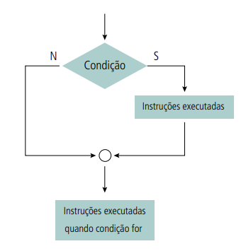

# Estruturas de controle: a tomada de decisões

## Introdução

Agora que já sabemos como armazenar dados e realizar operações com eles, podemos começar a criar programas mais complexos. Para isso, precisamos de estruturas de controle, que são comandos que permitem que o programa tome decisões e execute ações diferentes dependendo de uma condição.

## Estruturas de controle condicionais

### Estrutura de decisão simples: (comando: se...fim_se)

O comando SE é o mais simples dos comandos de controle condicional. Ele permite que o programa execute um bloco de comandos caso uma condição seja verdadeira. A sintaxe do comando SE é a seguinte:

```Pseduocódigo

SE condição ENTAO
    < instruções para a condição verdadeira >    
FIMSE
< instruções para a condição falsa ou após ser verdadeira >

```


Exemplo da utilização da estrutura se...então...fim_se através de diagrama de blocos.

O comando SE é composto por duas partes: a condição e o bloco de comandos. A condição é uma expressão lógica que pode ser verdadeira ou falsa. Se a condição for verdadeira, o bloco de comandos é executado. Se a condição for falsa, o bloco de comandos é ignorado.

A condição pode ser uma expressão lógica ou uma variável lógica. Se for uma expressão lógica, ela deve ser colocada entre parênteses. Se for uma variável lógica, não deve ser colocada entre parênteses.

O bloco de comandos é um conjunto de comandos que serão executados caso a condição seja verdadeira. O bloco de comandos deve ser indentado, ou seja, deve ser recuado para a direita. A indentação é importante para que o programa saiba quais comandos fazem parte do bloco de comandos e quais comandos não fazem parte do bloco de comandos.

### Estrutura de decisão composta: (comando: se...senão...fim_se)

O comando SE...SENÃO é um comando de controle condicional que permite que o programa execute um bloco de comandos caso uma condição seja verdadeira e outro bloco de comandos caso a condição seja falsa. A sintaxe do comando SE...SENÃO é a seguinte:

```Pseudocódigo

SE condição ENTAO
    < instruções para a condição verdadeira >
SENÃO
    < instruções para a condição falsa >
FIMSE
< continuação das instruções do algoritmo >

```


Representação em diagrama de blocos para a estrutura de decisão composta.

O comando SE...SENÃO é composto por três partes: a condição, o bloco de comandos para a condição verdadeira e o bloco de comandos para a condição falsa. A condição é uma expressão lógica que pode ser verdadeira ou falsa. Se a condição for verdadeira, o bloco de comandos para a condição verdadeira é executado. Se a condição for falsa, o bloco de comandos para a condição falsa é executado.

A condição pode ser uma expressão lógica ou uma variável lógica. Se for uma expressão lógica, ela deve ser colocada entre parênteses. Se for uma variável lógica, não deve ser colocada entre parênteses.

### Estruturas de decisão encadeadas

Uma instrução de seleção encadeada é uma instrução que permite que o programa execute um bloco de comandos caso uma condição seja verdadeira e outro bloco de comandos caso a condição seja falsa. A diferença entre a instrução de seleção encadeada e a instrução de seleção composta é que a instrução de seleção encadeada permite que o programa execute mais de um bloco de comandos caso a condição seja falsa. A sintaxe da instrução de seleção encadeada é a seguinte:

```Pseudocódigo

SE condição ENTAO
    < instruções para a condição verdadeira >
SENÃO
    SE condição ENTAO
        < instruções para a condição verdadeira >
    SENÃO
        < instruções para a condição falsa >
    FIMSE
...
FIMSE
< continuação das instruções do algoritmo >

```


Representação em diagrama de blocos para a estrutura de decisão encadeada

A instrução de seleção encadeada é composta por três partes: a condição, o bloco de comandos para a condição verdadeira e o bloco de comandos para a condição falsa. A condição é uma expressão lógica que pode ser verdadeira ou falsa. Se a condição for verdadeira, o bloco de comandos para a condição verdadeira é executado. Se a condição for falsa, o bloco de comandos para a condição falsa é executado.

A condição pode ser uma expressão lógica ou uma variável lógica. Se for uma expressão lógica, ela deve ser colocada entre parênteses. Se for uma variável lógica, não deve ser colocada entre parênteses.

### Estruturas de decisão de múltipla escolha

Uma instrução de seleção de múltipla escolha é uma instrução que permite que o programa execute um bloco de comandos caso uma condição seja verdadeira e outro bloco de comandos caso a condição seja falsa. A diferença entre a instrução de seleção de múltipla escolha e a instrução de seleção encadeada é que a instrução de seleção de múltipla escolha permite que o programa execute mais de um bloco de comandos caso a condição seja falsa. A sintaxe da instrução de seleção de múltipla escolha é a seguinte:

```Pseudocódigo

ESCOLHA variável
    CASO valor1
        < instruções para o valor1 >
    CASO valor2
        < instruções para o valor2 >
    ...
    CASO valorN
        < instruções para o valorN >
    SENÃO
        < instruções para o valor padrão >
FIMESCOLHA
< continuação das instruções do algoritmo >

```


Representação em diagrama de blocos para a estrutura de decisão de múltipla escolha.

A instrução de seleção de múltipla escolha é composta por três partes: a variável, os valores e o bloco de comandos para o valor padrão. A variável é uma variável que pode assumir um dos valores especificados. Os valores são os valores que a variável pode assumir. O bloco de comandos para o valor padrão é executado caso a variável não assuma nenhum dos valores especificados.

## Exemplos em Python

### Exemplo 1: Estrutura de decisão simples

```Python

# Exemplo 1: Estrutura de decisão simples

# Entrada de dados
idade = int(input("Digite a sua idade: "))
# Processamento
if idade >= 18:
    print("Você é maior de idade.")
# Saída de dados
print("Fim do programa.")

```

### Exemplo 2: Estrutura de decisão composta

```Python

# Exemplo 2: Estrutura de decisão composta

# Entrada de dados
idade = int(input("Digite a sua idade: "))
# Processamento
if idade >= 18:
    print("Você é maior de idade.")
else:
    print("Você é menor de idade.") 
# Saída de dados
print("Fim do programa.")

```

### Exemplo 3: Estrutura de decisão encadeada

```Python

# Exemplo 3: Estrutura de decisão encadeada

# Entrada de dados
idade = int(input("Digite a sua idade: "))
# Processamento
if idade >= 18:
    print("Você é maior de idade.")
else:
    # Validação encadeada
    if idade >= 16:
        print("Você é menor de idade, mas já pode votar.")
    else:
        print("Você é menor de idade.")
# Saída de dados
print("Fim do programa.")

```

### Exemplo 4: Estrutura de decisão de múltipla escolha

```Python

# Exemplo 4: Estrutura de decisão de múltipla escolha

# Entrada de dados
idade = int(input("Digite a sua idade: "))
# Processamento
if idade >= 18:
    print("Você é maior de idade.")
elif idade >= 16:
    print("Você é menor de idade, mas já pode votar.")
else:
    print("Você é menor de idade.")
# Saída de dados
print("Fim do programa.")

```

Exemplo com a estrutura de decisão de múltipla escolha utilizando o comando switch-case:

```Python

# Exemplo 4: Estrutura de decisão de múltipla escolha

# Entrada de dados
idade = int(input("Digite a sua idade: "))
# Processamento com switch-case

def switch(idade):
    switcher = {
        18: "Você é maior de idade.",
        16: "Você é menor de idade, mas já pode votar.",
        0: "Você é menor de idade."
    }
    return switcher.get(idade, "Idade inválida.")

print(switch(idade))
# Saída de dados
print("Fim do programa.")

```

Exemplo utilizando match:

```Python

# Exemplo 4: Estrutura de decisão de múltipla escolha

# Entrada de dados
idade = int(input("Digite a sua idade: "))
# Processamento com match
match idade:
    case 18:
        print("Você é maior de idade.")
    case 16:
        print("Você é menor de idade, mas já pode votar.")
    case 0:
        print("Você é menor de idade.")
    case _:
        print("Idade inválida.")

# Saída de dados
print("Fim do programa.")

```