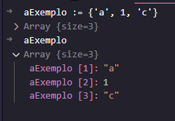
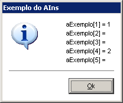
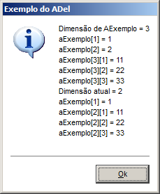
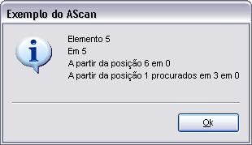

# 8 - Estruturas homogêneas: vetores e matrizes

## Índice

- [8 - Estruturas homogêneas: vetores e matrizes](#8---estruturas-homogêneas-vetores-e-matrizes)
  - [Índice](#índice)
  - [Vetores](#vetores)
    - [Introdução](#introdução)
    - [Declaração de vetores](#declaração-de-vetores)
      - [Declaração de vetores com a função Array()](#declaração-de-vetores-com-a-função-array)
      - [Declaração de vetores com ou sem elementos definidos](#declaração-de-vetores-com-ou-sem-elementos-definidos)
    - [Declaração e atribuição de valores a vetores](#declaração-e-atribuição-de-valores-a-vetores)
    - [Inclusão de elementos em vetores](#inclusão-de-elementos-em-vetores)
    - [Edição de elementos em vetores](#edição-de-elementos-em-vetores)
    - [Exclusão de elementos em vetores](#exclusão-de-elementos-em-vetores)
    - [Tamanho de vetores](#tamanho-de-vetores)
    - [Ordenação de vetores](#ordenação-de-vetores)
    - [Busca de elementos em vetores](#busca-de-elementos-em-vetores)
    - [Busca de elementos em vetores multidimensionais](#busca-de-elementos-em-vetores-multidimensionais)
    - [Demais funções para vetores Em advpl](#demais-funções-para-vetores-em-advpl)
  - [Observações](#observações)
  - [Cuidados com Matrizes](#cuidados-com-matrizes)

## Vetores

### Introdução

Vetores são conhecidos como variáveis compostas homogêneas unidimensionais. Isto quer dizer que se trata de um conjunto de variáveis de mesmo tipo, que possuem o mesmo identificador (nome) e são armazenadas sequencialmente na memória. Como as variáveis tem o mesmo nome, o que as distingue é um índice que referencia sua localização dentro da estrutura, ou seja, podemos identificar o primeiro, o segundo, até o último elemento do conjunto que pode ser identificado por sua posição.

- Vetores são estruturas de dados homogêneas, ou seja, que armazenam dados do mesmo tipo;
- São estruturas de dados sequenciais, ou seja, que armazenam dados de forma sequencial, um após o outro;
- São estruturas de dados indexadas, ou seja, que armazenam dados de forma indexada, cada elemento do vetor possui um índice que o identifica.

Fazendo uma analogia, podemos identificar a presença de um vetor à lista de alunos de uma turma em uma escola. Nessas escolas, os alunos recebem números conforme a ordem alfabética de seus nomes na turma. Cada aluno sabe seu número e, em certas oportunidades, o uso deste número é útil para cada um deles.

### Declaração de vetores

O Array (ou Matriz) no AdvPL é um tipo básico de dado que permite criar listas de tamanho e conteúdo dinâmico.

Cada elemento de um array pode conter elementos de qualquer tipo do AdvPL, inclusive os tipos “B” (CodeBlock), “O” (Objeto), “U” (NIL — ou Nulo), inclusive o tipo “A” (Array).

O conteúdo de cada elemento do array pode ser endereçado diretamente pela sua posição ordinal no Array, bastando para isso colocar em frente ao array a posição desejada entre [ ] (colchetes). Os Arrays em AdvPL começam na posição 1.

O Tipo de dado “A” Array no AdvPL é tratado como uma variável de referência implícita. Desse modo, quando fazemos uma atribuição de uma variável que contém um array para outra variável, é criada uma referência ao array armazenado na primeira variável. Isto significa que, na memória o array é único, e agora eu tenho duas variáveis que apontam para o mesmo conteúdo. Se eu alterar o conteúdo de um elemento dentro desse array, as duas variáveis vão apontar para o mesmo conteúdo alterado.

#### Declaração de vetores com a função Array()

Para declarar um vetor podemos utilizar a função **Array()**, que recebe como parâmetro o tamanho do vetor. O tamanho do vetor é a quantidade de elementos que ele pode armazenar. O tamanho do vetor é um número inteiro positivo.

Sintaxe:

```advpl

Array( < nElementos1 >, [ xElemento2,xElemento3...xElemento16 ] )

```

Parâmetros:

- nElementos1: número inteiro que indica a quantidade de elementos que o vetor pode armazenar;
- xElemento2,xElemento3...xElemento16: são os elementos que serão armazenados no vetor. Se for numérico, cria um array multidimensional, se for diferente de número inicializa o array com o valor informado.

Retorno:

- Retorna um array com a dimensão especificada.

Observações:

- Até 16 parâmetros podem ser informados, para criar arrays multidimensionais. Somente o último parâmetro pode ser diferente de número para inicializar o array o valor informado.

Exemplos:

```advpl

aExemplo := Array( 10 ) // declara um vetor de 10 elementos

```


aExemplo := Array( 10, 7 ) // declara um vetor de 10 elementos multidimensional, com todos 7 elementos

```advpl

aExemplo := Array( 10, 7 )

```


#### Declaração de vetores com ou sem elementos definidos

Para declarar um vetor sem elementos, usando abertura e fechamento de chaves  { }.

Para declarar um array com conteúdo, basta informar o conteúdo de cada elemento dentro das chaves, e separar os elementos por vírgula.

Exemplo:

```advpl

aExemplo := {} // declara um vetor sem elementos ou vazio

```

 

### Declaração e atribuição de valores a vetores

Para atribuir valores a um vetor, basta informar o conteúdo de cada elemento dentro das chaves, e separar os elementos por vírgula.

Exemplo:

```advpl
aExemplo := {'a', 'b', 'c'} // declara um vetor com 3 elementos

```


```advpl
aExemplo := {'a', 1, 'c'} // declara um vetor com 3 elementos

```



### Inclusão de elementos em vetores

Para incluir elementos em um vetor utilizamos a função **aAdd()**. Esta função recebe como parâmetro o vetor e o elemento que será incluído no vetor.

Sintaxe:

```advpl

aAdd( < aArray >, < xElemento > )

```

Parâmetros:

- aArray: array que receberá o elemento;
- xElemento: Indica uma expressão válida que será o valor do novo elemento.

Retorno:

- Retorna o valor especificado em xElemento.

Observações:

- Caso seja especificado em `xElemento` um outro array, o novo elemento no array destino terá uma referência ao array especificado.
- Essa função é útil na construção de filas ou listas dinâmicas. Utilize para aumentar o tamanho de um array dinamicamente.
- Essa função é semelhante a função ASize, mas adiciona apenas um elemento por vez. Já `ASize` permite aumentar ou diminuir um array a um tamanho especificado. AAdd também possui a vantagem de poder atribuir um valor ao novo elemento, enquanto que ASize não pode. Além disso, AAdd pode parecer igual a função `AIns`, mas não é, pois AIns move os elementos dentro de um array, mas não modifica seu tamanho.

Exemplos:

```advpl

aExemplo := {} // declara um vetor sem elementos ou vazio

aAdd( aExemplo, 'a' ) // inclui o elemento 'a' no vetor
aAdd(aExemplo, {}) // inclui um array vazio no vetor

```

Outra forma de incluir elementos em um vetor é utilizando a função **aIns()**. Esta função recebe como parâmetro o vetor, e a posição que o elemento será incluído no vetor. O valor do elemento é nulo.

Esta função empurra os elementos do vetor para a direita, para abrir espaço para o novo elemento.

Sintaxe:

```advpl

aIns( < aArray >, < nPosicao > )

```

Parâmetros:

- aArray: array que receberá o elemento;
- nPosicao: Indica a posição, a partir da primeira, na qual será inserido um elemento nulo.

retorna:

- Retorna o array com o novo elemento.

Observações:

- Essa função não altera a quantidade de elementos do array. Após inserir um elemento nulo na posição definida, os demais sobem uma posição e o `último é descartado`.
- Se precisar adicionar um elemento sem perder o último, utilize a função `AAdd`. Essa função, permite acrescentar um elemento no final do array e, em seguida, inserir na posição desejada.

Exemplo:

```advpl

#DEFINE CRLF Chr(13)+Chr(10)
 
User Function ains1()
  Local aExemplo := { 1, 2, { 11, 22, 33 }, 4, 5 }
  Local cMensagem := ""
   
  //+----------------------------------------------------------------------------+
  //|Exemplifica o uso da função AIns                                            |
  //+----------------------------------------------------------------------------+
   
  AIns( aExemplo[3], 2 )
  AIns( aExemplo, 2 )
  AIns( aExemplo, 3 )
   
  cMensagem += "aExemplo[1] = " + cValToChar( aExemplo[1] ) + CRLF
  cMensagem += "aExemplo[2] = " + cValToChar( aExemplo[2] ) + CRLF
  cMensagem += "aExemplo[3] = " + cValToChar( aExemplo[3] ) + CRLF
  cMensagem += "aExemplo[4] = " + cValToChar( aExemplo[4] ) + CRLF
  cMensagem += "aExemplo[5] = " + cValToChar( aExemplo[5] )
   
  varinfo( "aExemplo", aExemplo )
   
  //+----------------------------------------------------------------------------+
  //|Apresenta uma mensagem com os resultados obtidos                            |
  //+----------------------------------------------------------------------------+
Return MsgInfo( cMensagem, "Exemplo do AIns" )

```

resultado:


### Edição de elementos em vetores

É possível editar um elemento de um vetor, basta informar o vetor e o elemento que será editado.

Exemplo:

```advpl

aExemplo := {'a', 'b', 'c'} // declara um vetor com 3 elementos

aExemplo[2] := 'd' // altera o elemento 2 do vetor para 'd'

// resultado: {'a', 'd', 'c'}


```

### Exclusão de elementos em vetores

Para excluir um elemento de um vetor é necessário utilizar a função **aDel()**. Esta função recebe como parâmetro o vetor e a posição do elemento que será excluído, retornando o array sem o elemento excluído.

Sintaxe:

```advpl

aDel( < aArray >, < nPosicao > )

```

Parâmetros:

- aArray: Indica o array que contém um elemento para ser eliminado;
- nPosicao: Indica a posição do elemento no array, a partir do primeiro, que será eliminado.

retorna:

- Retorna o array sem o elemento excluído.

Observações:

O último elemento pode ser removido da estrutura, se conveniente, através da função ASize.
Se <nPosicao> for maior do que o tamanho de <aArray> ou menor que 0, será retornado um erro AdvPL com a mensagem: "Array index out of bounds on adel".

Exemplo:

```advpl

#DEFINE CRLF Chr(13)+Chr(10)
User Function adel1()
  Local aExemplo := { 1, 2, { 11, 22, 33 } }
  Local cMensagem := ""
   
  //+----------------------------------------------------------------------------+
  //|Exemplifica o uso da função ADel                                            |
  //+----------------------------------------------------------------------------+
   
  cMensagem += "Dimensão de AExemplo = " + cValToChar( Len( aExemplo ) ) + CRLF
  cMensagem += "aExemplo[1] = "          + cValToChar( aExemplo[1]     ) + CRLF
  cMensagem += "aExemplo[2] = "          + cValToChar( aExemplo[2]     ) + CRLF
  cMensagem += "aExemplo[3][1] = "       + cValToChar( aExemplo[3][1]  ) + CRLF
  cMensagem += "aExemplo[3][2] = "       + cValToChar( aExemplo[3][2]  ) + CRLF
  cMensagem += "aExemplo[3][3] = "       + cValToChar( aExemplo[3][3]  ) + CRLF
   
  ADel( aExemplo, 2 )
  ASize( aExemplo, 2 )
   
  cMensagem += "Dimensão atual = " + cValToChar( Len( aExemplo ) ) + CRLF
  cMensagem += "aExemplo[1] = "    + cValToChar( aExemplo[1]     ) + CRLF
  cMensagem += "aExemplo[2][1] = " + cValToChar( aExemplo[2][1]  ) + CRLF
  cMensagem += "aExemplo[2][2] = " + cValToChar( aExemplo[2][2]  ) + CRLF
  cMensagem += "aExemplo[2][3] = " + cValToChar( aExemplo[2][3]  ) + CRLF
   
  //+----------------------------------------------------------------------------+
  //|Apresenta uma mensagem com os resultados obtidos                            |
  //+----------------------------------------------------------------------------+
Return MsgInfo(cMensagem, "Exemplo do ADel")

```

resultado:


### Tamanho de vetores

Para obter o tamanho de um vetor utilizamos a função **Len()**. Esta função recebe como parâmetro o vetor e retorna o tamanho do vetor.

Sintaxe:

```advpl

Len( < aArray > )

```

### Ordenação de vetores

Para ordenar um vetor utilizamos a função **aSort()**. Esta função recebe como parâmetro o vetor e retorna o vetor ordenado.

Sintaxe:

```advpl

ASort( < aVetor >, [ nInicio ], [ nCont ], [ bOrdem ] )

```

Parâmetros:

- aVetor: Indica o array que será ordenado;
- nInicio: Indica a posição inicial do array que será ordenado. Se omitido, será considerado o primeiro elemento do array;
- nCont: Indica a quantidade de elementos do array que serão ordenados. Se omitido, serão considerados todos os elementos do array;
- bOrdem: Indica se a ordenação será crescente ou decrescente. Se omitido, será considerada a ordenação crescente.

Retorno:

- Retorna o array ordenado.

Exemplo:

```advpl

#DEFINE CRLF Chr(13)+Chr(10)
User Function Exemplo()
Local aExemplo := {}
Local cMensagem := ""
//+----------------------------------------------------------------------------+
//|Exemplifica o uso da função ASort                                           |
//+----------------------------------------------------------------------------+
  AAdd(aExemplo, "Banana")
  AAdd(aExemplo, "Maçã")
  AAdd(aExemplo, "Pêra")
  AAdd(aExemplo, "Limão")
  AAdd(aExemplo, "Abacaxi")
  AAdd(aExemplo, "Laranja")
  AAdd(aExemplo, "Mamão")
  AAdd(aExemplo, "Graviola")
  ASort(aExemplo)
  cMensagem += "Ordem crescente: " + CRLF
  cMensagem += aExemplo[1] + CRLF
  cMensagem += aExemplo[2] + CRLF
  cMensagem += aExemplo[3] + CRLF
  cMensagem += aExemplo[4] + CRLF
  cMensagem += aExemplo[5] + CRLF
  cMensagem += aExemplo[6] + CRLF
  cMensagem += aExemplo[7] + CRLF
  cMensagem += aExemplo[8] + CRLF
  ASort(aExemplo, , , {|x,y|x > y})
  cMensagem += "Ordem decrescente: " + CRLF
  cMensagem += aExemplo[1] + CRLF
  cMensagem += aExemplo[2] + CRLF
  cMensagem += aExemplo[3] + CRLF
  cMensagem += aExemplo[4] + CRLF
  cMensagem += aExemplo[5] + CRLF
  cMensagem += aExemplo[6] + CRLF
  cMensagem += aExemplo[7] + CRLF
  cMensagem += aExemplo[8] + CRLF
//+----------------------------------------------------------------------------+
//|Apresenta uma mensagem com os resultados obtidos                            |
//+----------------------------------------------------------------------------+
Return MsgInfo(cMensagem, "Exemplo do ASort")

```

resultado:


### Busca de elementos em vetores

Para buscar um elemento em um vetor utilizamos a função **aScan()**. Esta função recebe como parâmetro o vetor e o elemento que será buscado no vetor, retornando a posição do elemento no vetor.

Sintaxe:

```advpl

AScan( < aDest >, < xExpr >, [ nStart ], [ nCount ] )

```

Parâmetros:

- aDest: Indica o array que será pesquisado;
- xExpr: Indica a expressão de busca. Para um array de dimensão simples, pode ser colocado diretamente um valor a ser procurado. Para uma busca mais complexa ou para uma busca em array muti-dimensional, deve ser especificado um bloco de código;
- nStart: Indica a posição inicial do array que será pesquisado. Se omitido, será considerado o primeiro elemento do array;
- nCount: Indica a quantidade de elementos do array que serão pesquisados. Se omitido, serão considerados todos os elementos do array.

Retorno:

- Retorna a posição do elemento no array. Se não for encontrado, retorna 0.

Observações:

Em uma busca utilizando um array de dimensão simples, a expressão de busca <xExpr> pode ser do tipo "C" (Caractere), "N" (Numérico), "D" (Data) ou "L" (Lógico). O array pode conter elementos de tipos variados, as comparações somente serão realizadas quando o elemento do array em questão for do mesmo tipo do conteúdo informado para busca. Quando realizada a busca por uma string, a determinação da igualdade entre a string informada para busca e a string do elemento do array está sujeita ao estado da definição SET EXACT do AdvPL, por padrão desligada – veja comportamento do operador "=" (igualdade simples) entre strings do AdvPL.

Caso a busca em questão seja feita em um array multi-dimensional (array de array(s)), ou a condição de busca seja mais complexa ou específica, até mesmo uma condição composta, podemos especificar em <xExpr> um bloco de código, que receberá como parâmetro um elemento por vez do array aDest, a partir da posição inicial de busca. O code-block deve retornar um valor lógico .T. (Verdadeiro) caso o elemento em questão seja o elemento desejado, e a condição de busca seja satisfeita, e quando isto acontecer, a função AScan retornará o número do elemento do array aDest que foi informado ao bloco de código que atendeu a condição de busca. Caso o bloco de código retorne .F. (Falso), indicando que o elemento informado não atende a condição de busca, será fornecido o proximo elemento do array e o bloco de código é avaliado novamente. A operação de busca é encerrada até que todos os elementos compreendidos pela parametrização nStart / nCount sejam vasculhados. Se nenhuma chamada do bloco de código retornar .T., a função AScan retornará 0, indicando que nenhum elemento pesquisado satisfez a condição de busca.

Exemplo:

```advpl

#DEFINE CRLF Chr(13)+Chr(10)
user function ascan1()
  Local aExemplo := { 1, 2, 3, 4, 5, 6, 7, 8, 9, 10 }
  Local cMensagem := ""
   
  //+----------------------------------------------------------------------------+
  //|Exemplifica o uso da função AScan                                           |
  //+----------------------------------------------------------------------------+
   
  cMensagem += "Elemento 5 " + CRLF
  cMensagem += "Em " + cValToChar( AScan( aExemplo, 5 ) ) + CRLF
  cMensagem += "A partir da posição 6 em " + ;
               cValToChar( AScan( aExemplo, 5, 6 ) ) + CRLF
  cMensagem += "A partir da posição 1 procurados em 3 em " + ;
               cValToChar( AScan( aExemplo, 5, 6, 3 ) ) + CRLF
  //+----------------------------------------------------------------------------+
  //|Apresenta uma mensagem com os resultados obtidos                            |
  //+----------------------------------------------------------------------------+
Return MsgInfo( cMensagem, "Exemplo do AScan" )

```

resultado:



### Busca de elementos em vetores multidimensionais

Para buscar um elemento em um vetor multidimensional utilizamos a função **aScan()**. Esta função recebe como parâmetro o vetor e o elemento que será buscado no vetor, retornando a posição do elemento no vetor.

Sintaxe:

```advpl

AScan( < aDest >, < xExpr >, [ nStart ], [ nCount ] )

```

Exemplo:

```advpl

aadd(aEsporte,{"futebol","1"})
aadd(aEsporte,{"volei","2"})
aadd(aEsporte,{"natacao","3"})
aadd(aEsporte,{"basquete","4"})

//busca o elemento "volei" no array aEsporte
nposicao := ascan(aEsporte, {|x| x[1] == "volei"})

```

para cada elemento do array aEsporte, o bloco de código verifica se o elemento na posição 1 é igual a "volei". Se for igual, retorna a posição do elemento no array, caso contrário, é verificado o próximo elemento do array, caso não encontre o valor pesquisado em nenhum elemento do array, retorna 0.

### Demais funções para vetores Em advpl

Existem outras funções que podem ser utilizadas para manipular vetores, são elas:

- [**Array()**](https://tdn.totvs.com/display/tec/Array): Cria um array com a dimensão especificada;
- [**aAdd()**](https://tdn.totvs.com/display/tec/AAdd): Adiciona um elemento no final do array;
- [**Aclone()**](https://tdn.totvs.com/display/tec/AClone): Cria uma cópia do array;
- [**aCopy()**](https://tdn.totvs.com/display/tec/ACopy): Copia um array para outro;
- [**aDel()**](https://tdn.totvs.com/display/tec/ADel): Exclui um elemento do array;
- [**afill()**](https://tdn.totvs.com/display/tec/AFill): Preenche um array com um valor;
- [**aIns()**](https://tdn.totvs.com/display/tec/AIns): Insere um elemento no array;
- [**aScan()**](https://tdn.totvs.com/display/tec/AScan): Busca um elemento no array;
- [**aScanX()**](https://tdn.totvs.com/display/tec/AScanX): Busca um elemento no array;
- [**aSize()**](https://tdn.totvs.com/display/tec/ASize): Altera o tamanho do array;
- [**aSort()**](https://tdn.totvs.com/display/tec/ASort): Ordena um array;
- [**aTail()**](https://tdn.totvs.com/display/tec/ATail): Retorna o último elemento do array;

## Observações

Um array pode ser muito utilizado para armazenar dados, porem a pesquisa em um array pode ser muito lenta, pois é necessário percorrer todos os elementos do array até encontrar o elemento desejado. 

## Cuidados com Matrizes

Cuidados com Matrizes

Matrizes são listas de elementos, portanto memória é necessária para armazenar estas informações. Como as matrizes podem ser multidimensionais, a memória necessária será a multiplicação do número de itens em cada dimensão da matriz, considerando-se o tamanho do conteúdo de cada elemento contido nesta. Portanto o tamanho de uma matriz pode variar muito.

A facilidade da utilização de matrizes, mesmo que para armazenar informações em pacotes como descrito anteriormente, não é compensada pela utilização em memória quando o número de itens em um array for muito grande. Quando o número de elementos for muito grande deve-se procurar outras soluções, como a utilização de um arquivo de banco de dados temporário.

Não há limitação para o número de dimensões que uma matriz pode ter, mas o número de elementos máximo (independentes das dimensões onde se encontram) é de 100000 (cem mil) elementos.