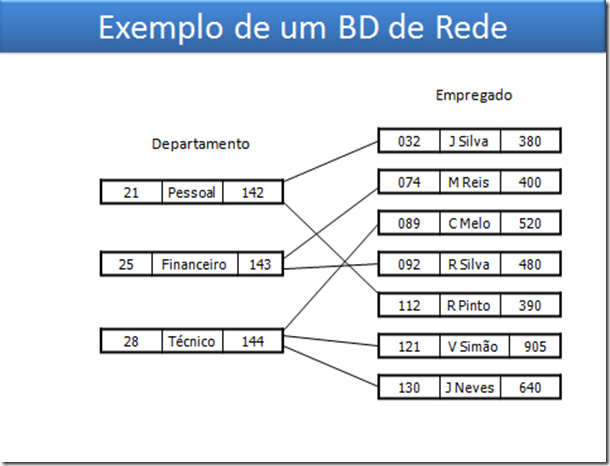
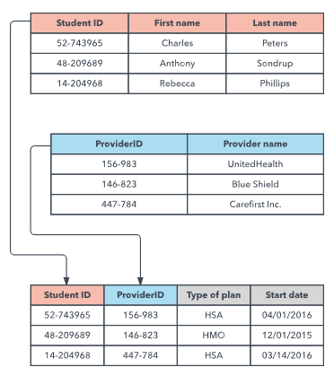
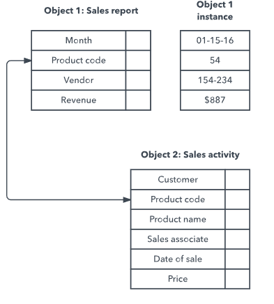

# O que é um banco de dados?

## Sumário

- [O que é um banco de dados?](#o-que-é-um-banco-de-dados)
  - [Sumário](#sumário)
  - [Introdução](#introdução)
  - [Sistema gerenciador de banco de dados (SGBD)](#sistema-gerenciador-de-banco-de-dados-sgbd)
  - [Modelo de dados](#modelo-de-dados)
    - [Modelo Hierárquico](#modelo-hierárquico)
    - [Modelo de Rede](#modelo-de-rede)
    - [Modelo Relacional](#modelo-relacional)
    - [Modelo Orientado a Objetos](#modelo-orientado-a-objetos)
    - [Modelo Orientado a Documentos](#modelo-orientado-a-documentos)
  - [Referências](#referências)

## Introdução

Banco de dados ou base de dados são conjuntos de arquivos relacionados entre si com registros sobre pessoas, lugares ou coisas. São coleções organizadas de dados que se relacionam de forma a criar algum sentido (Informação) e dar mais eficiência durante uma pesquisa ou estudo científico.

## Sistema gerenciador de banco de dados (SGBD)

Sistema gerenciador de banco de dados (SGBD) é um software que permite a organização, manipulação e recuperação dos dados de um banco de dados. Os SGBDs podem ser classificados de acordo com o modelo de dados que utilizam, tais como o modelo relacional ou o modelo orientado a objetos.

## Modelo de dados

### Modelo Hierárquico

O `modelo hierárquico` é um modelo de dados que organiza os dados de forma hierárquica, ou seja, os dados são organizados em uma estrutura semelhante a uma árvore invertida, em que um dado pode possuir vários dados abaixo dele, mas um dado só pode possuir um dado acima dele. Esse modelo foi usado principalmente pelos Sistemas de Gestão de Informações da IBM nos anos 60 e 70, mas são raramente vistos hoje devido a certas ineficiências operacionais.

Mais informações: [Modelo Hierárquico](https://pt.wikipedia.org/wiki/Modelo_hier%C3%A1rquico_de_banco_de_dados)

### Modelo de Rede

O `modelo em redes` surgiu como uma extensão ao modelo hierárquico, eliminando o conceito de hierarquia e permitindo que um mesmo registro estivesse envolvido em várias associações.
No modelo em rede, os registros são organizados em grafos onde aparece um único tipo de associação (set) que define uma relação 1:N entre 2 tipos de registros: proprietário e membro. Um registro pode ser proprietário em uma associação e membro em outra. Um registro pode ser membro em várias associações.

Estes dois modelos: Hierárquico e Rede são Orientados a Registros, isto é, qualquer acesso à base de dados – inserção, consulta, alteração ou remoção – é feito em um registro de cada vez.

Foi mais popular nos anos 70, depois de ter sido formalmente definido pela Conferência sobre Linguagens de Sistemas de Dados (CODASYL).

### Modelo Relacional

O `modelo relacional` é um modelo de dados representativo que tem como base a lógica de predicados e a teoria dos conjuntos. Foi proposto em 1970 por Edgar Frank Codd, da IBM Research, em San Jose, Califórnia. Um modelo de dados relacional usa uma coleção de tabelas para representar tanto dados como as relações entre esses dados. Cada tabela tem múltiplas colunas e cada linha contém uma instância de dados para a categoria definida por essas colunas. Cada coluna tem um nome exclusivo e as linhas de cada tabela são únicas.

Neste modelo, os dados são organizados em `relações (tabelas)`. Uma relação é uma tabela com linhas e colunas. As colunas têm um nome e um tipo de dados. As linhas são chamadas de `tuplas`. Cada tupla contém uma instância de dados para as categorias definidas pelas colunas. As tabelas são relacionadas entre si através de chaves.

O uso de `chaves` é o que diferencia o modelo relacional dos outros modelos. As chaves são usadas para relacionar as tabelas. Uma `chave primária` é uma coluna ou conjunto de colunas que identifica unicamente uma linha na tabela. Uma `chave estrangeira` é uma coluna ou conjunto de colunas que estabelece uma relação com uma chave primária.

Dentro do banco de dados, as tabelas podem ser normalizadas, ou seja, podem ser divididas em outras tabelas para evitar a redundância de dados. A normalização é um processo que organiza as tabelas de um banco de dados para minimizar a redundância de dados. A normalização é importante porque evita a duplicação de dados e, consequentemente, a inconsistência de dados.

Os bancos de dados relacionais são tipicamente escritos em SQL (Structured Query Language). O SQL é uma linguagem de consulta que permite a criação, manipulação e recuperação de dados de um banco de dados relacional.

### Modelo Orientado a Objetos

O `modelo orientado a objetos` é um modelo de dados que define os dados não como entidades, mas como objetos, ou seja, como uma abstração de um objeto real, que possui características (atributos) e comportamentos (métodos). O modelo orientado a objetos é uma evolução do modelo relacional, que utiliza o conceito de objetos para representar os dados e suas inter-relações.

Há vários tipos de bancos de dados orientados para objetos:

- Bancos de dados multimídia: são bancos de dados que armazenam e manipulam dados multimídia, como imagens, sons e vídeos.
- Bancos de dados hipertexto: permite que qualquer objeto seja vinculado a qualquer outro objeto. É útil para organizar lotes de dados diferentes, mas não é ideal para a análise numérica.

O modelo de banco de dados orientado a objetos é o modelo de banco de dados pós-relacional mais conhecido, uma vez que ele incorpora tabelas, mas não se limita a elas. Tais modelos também são conhecidos como modelos de bancos de dados híbridos.

Mais informações: [Modelo Orientado a Objetos](https://pt.wikipedia.org/wiki/Banco_de_dados_orientado_a_objetos)

### Modelo Orientado a Documentos

O `modelo orientado a documentos` é um modelo de dados que armazena os dados em documentos semiestruturados, como JSON ou XML. Os documentos são armazenados em coleções, que são agrupamentos de documentos. Cada documento pode ter uma estrutura diferente, mas geralmente possui um conjunto de campos com tipos de dados associados.

Banco de Dados Orientados a Documentos tem como característica conter todas as informações importantes em um único documento, ser livre de esquemas, possuir identificadores únicos universais (UUID), possibilitar a consulta de documentos através de métodos avançados de agrupamento e filtragem (MapReduce) e também permitir redundância e inconsistência.

Esses bancos de dados também são chamados de Bancos NoSQL (Not Only SQL). Esse termo NoSQL foi criado em 1998 por Carlo Strozzi para descrever seu banco de dados relacional que não tinha uma linguagem de consulta SQL. Hoje, o termo NoSQL é usado para descrever bancos de dados não relacionais.

Existem diversos Banco de Dados NoSQL, os mais conhecidos são: MongoDB, DynamoDB, Azure Table Storage, Berkeley DB, Hadoop, Cassandra, Hypertable, Amazon SimpleDB, CouchDB, RavenDB, Neo4J, Infinite Graph, InforGrid, etc.

Este modelo é muito utilizado em aplicações web, pois é muito flexível e escalável.

## Referências

- [O que é um banco de dados?](https://pt.wikipedia.org/wiki/Banco_de_dados)
- [Sistema gerenciador de banco de dados](https://pt.wikipedia.org/wiki/Sistema_gerenciador_de_banco_de_dados)
- [Modelo de dados](https://www.lucidchart.com/pages/pt/o-que-e-um-modelo-de-banco-de-dados)
- [Introdução ao MongoDB](https://www.devmedia.com.br/introducao-ao-mongodb/30792#Banco)
- [Introdução a Banco de Dados](https://www.ime.usp.br/~jef/apostila.pdf)
