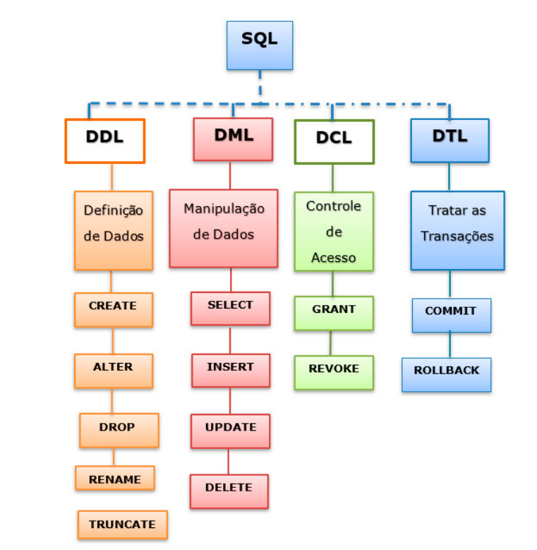

# Linguagens de Base de Dados relacional

## Sumário

- [Linguagens de Base de Dados relacional](#linguagens-de-base-de-dados-relacional)
  - [Sumário](#sumário)
  - [O que é SQL?](#o-que-é-sql)
    - [Linguagens de Base de Dados](#linguagens-de-base-de-dados)
      - [Data Definition Language ou Linguagem de Definição de Dados (DDL)](#data-definition-language-ou-linguagem-de-definição-de-dados-ddl)
      - [Data Manipulation Language ou Linguagem de Manipulação de Dados (DML)](#data-manipulation-language-ou-linguagem-de-manipulação-de-dados-dml)
      - [Data Query Language ou Linguagem de Consulta de Dados (DQL)](#data-query-language-ou-linguagem-de-consulta-de-dados-dql)
      - [Data Control Language ou Linguagem de Controle de Dados (DCL)](#data-control-language-ou-linguagem-de-controle-de-dados-dcl)
      - [Data Transaction Language ou Linguagem de Transação de Dados (DTL)](#data-transaction-language-ou-linguagem-de-transação-de-dados-dtl)
      - [Data Schema Definition Language ou Linguagem de Definição de Esquema (SDL)](#data-schema-definition-language-ou-linguagem-de-definição-de-esquema-sdl)
      - [Data View Definition Language ou Linguagem de Definição de Visão (VDL)](#data-view-definition-language-ou-linguagem-de-definição-de-visão-vdl)
    - [Clausulas SQL](#clausulas-sql)
      - [WHERE](#where)
      - [AND, OR e NOT](#and-or-e-not)
      - [ORDER BY](#order-by)
      - [GROUP BY](#group-by)
      - [HAVING](#having)
      - [AS](#as)
      - [IN](#in)
      - [BETWEEN](#between)
      - [LIKE](#like)
      - [JOIN](#join)
      - [UNION](#union)
      - [IS NULL](#is-null)
      - [IS NOT NULL](#is-not-null)
      - [EXISTS](#exists)
      - [CASE](#case)
      - [MIN e MAX](#min-e-max)
      - [COUNT](#count)
      - [AVG](#avg)
      - [SUM](#sum)
      - [INNER JOIN](#inner-join)
      - [LEFT JOIN](#left-join)
      - [RIGHT JOIN](#right-join)
      - [FULL JOIN](#full-join)
  - [Referências](#referências)


## O que é SQL?

SQL é uma linguagem de consulta estruturada (Structured Query Language) que permite a criação, manipulação e recuperação de dados de um banco de dados relacional.

A maioria dos bancos de dados relacionais suporta SQL, que é uma linguagem de programação padrão para bancos de dados relacionais, como Oracle, SQL Server, MySQL, DB2, Sybase, PostgreSQL e outros.

Alguns bancos de dados manipulam SQL de forma diferente, então, para garantir a portabilidade, o ANSI (American National Standards Institute) definiu um padrão SQL. O padrão SQL é chamado de SQL ANSI.

### Linguagens de Base de Dados

Com o SQL é possível criar, manipular e recuperar dados de um banco de dados relacional, e para isso, o SQL possui 6 subconjuntos de linguagens:

- Linguagem de Definição de Dados (DDL)
- Linguagem de Manipulação de Dados (DML)
- Linguagem de consulta de dados (DQL)
- Linguagem de Controle de Dados (DCL)
- Linguagem de Transação de Dados (DTL)
- Linguagem de Definição de Esquema (SDL)
- Linguagem de Definição de Visão (VDL)



#### Data Definition Language ou Linguagem de Definição de Dados (DDL)

Quando um banco de dados é criado, ele inicialmente está “vazio”. Assim, antes de começar a consultar e alterar dados e preciso definir onde e como as informações serão gravadas dentro do novo banco; então criam-se diversas tabelas explicitando o tipo de dados de cada campo, as chaves estrangeiras, os índices, as regras, etc.
Para a realização dessa definição dos dados é utilizada uma DDL (Data Definition Language – Linguagem de Definição de dados)

A linguagem de definição de dados (DDL) é usada para definir a estrutura do banco de dados, ou seja, é usada para criar, alterar e excluir objetos de banco de dados, como tabelas, índices, etc.

Comandos DDL:

- CREATE: cria um novo objeto de banco de dados, como uma tabela, índice, etc.
- ALTER: altera a estrutura de um objeto de banco de dados existente, como uma tabela.
- DROP: exclui um objeto de banco de dados existente, como uma tabela.
- TRUNCATE: exclui todos os registros de uma tabela, mas mantém sua estrutura.
- RENAME: renomeia um objeto de banco de dados existente.

Exemplos de uso:

```sql

    -- Criação de uma tabela
    CREATE TABLE tabela (
        coluna1 tipo_de_dado,
        coluna2 tipo_de_dado,
        coluna3 tipo_de_dado,
        ...
    );

    -- Alteração de uma tabela
    ALTER TABLE tabela ADD coluna tipo_de_dado;

    -- Exclusão de uma tabela
    DROP TABLE tabela;

    -- Exclusão de todos os registros de uma tabela
    TRUNCATE TABLE tabela;

    -- Renomeação de uma tabela
    RENAME TABLE tabela TO novo_nome;

```

#### Data Manipulation Language ou Linguagem de Manipulação de Dados (DML)

Após a carga dos dados nas tabelas criadas pelos comandos DDL, os comandos de manipulação de dados tornam possível sua manipulação, incluindo inserções, atualizações, exclusões e consultas (com a utilização do comando SELECT da SQL).

A DML visa à manipulação de dados (incluir, alterar, excluir e consultar) por meio do usuário.

Comandos DML:

- SELECT INTO: Realiza uma consulta em uma tabela e inclui o resultado como um novo registro em outra tabela
- INSERT: Cria um novo registro (linha) em uma tabela
- UPDATE: Permite modificar registros em uma tabela
- DELETE: Exclui um ou mais registros selecionados de uma tabela
- MERGE: Combina dados de múltiplas tabelas, mesclando elementos das declarações INSERT e UPDATE.

Exemplos de uso:

```sql

    -- Inserção de um registro em uma tabela
    INSERT INTO tabela (coluna1, coluna2, coluna3, ...) VALUES (valor1, valor2, valor3, ...);

    -- Atualização de um registro em uma tabela
    UPDATE tabela SET coluna1 = valor1, coluna2 = valor2, coluna3 = valor3, ... WHERE condição;

    -- Exclusão de um registro em uma tabela
    DELETE FROM tabela WHERE condição;

    -- Consulta de dados em uma tabela
    SELECT coluna1, coluna2, coluna3, ... FROM tabela WHERE condição;

```

#### Data Query Language ou Linguagem de Consulta de Dados (DQL)

A linguagem de consulta de dados é um subconjunto da `DML` que possui apenas a instrução de SELECT.

Comandos DQL:

- SELECT: Recupera dados de uma ou mais tabelas.

Exemplos de uso:

```sql

    -- Consulta de dados em uma tabela
    SELECT coluna1, coluna2, coluna3, ... FROM tabela WHERE condição;

```

#### Data Control Language ou Linguagem de Controle de Dados (DCL)

Permite controlar o acesso dos usuários aos dados em um banco de dados.

Comandos DCL:

- GRANT: concessão de privilégios a tabelas e visões.
- REVOKE: revogação de privilégios a tabelas e visões.

Exemplos do uso:

```sql

    -- Concessão de privilégios a tabelas e visões
    GRANT privilégio ON tabela TO usuário;

    -- Revogação de privilégios a tabelas e visões
    REVOKE privilégio ON tabela FROM usuário;

```

Mais informações sobre privilégios e permissões podem ser encontradas [aqui](https://learn.microsoft.com/pt-br/sql/t-sql/statements/grant-object-permissions-transact-sql?view=sql-server-ver16)

#### Data Transaction Language ou Linguagem de Transação de Dados (DTL)

A linguagem de transação de dados é usada para gerenciar transações em um banco de dados.

Comandos DTL:

- COMMIT: confirma uma transação.
- ROLLBACK: reverte uma transação.
- SAVEPOINT: identifica um ponto em uma transação para que a transação possa ser revertida até esse ponto.

Exemplos de uso:

```sql

    --Inicia uma transação
    BEGIN TRANSACTION;

    -- Confirma uma transação
    COMMIT;

    -- Reverte uma transação
    ROLLBACK;

    -- Identifica um ponto em uma transação para que a transação possa ser revertida até esse ponto
    SAVEPOINT savepoint_name;

```

#### Data Schema Definition Language ou Linguagem de Definição de Esquema (SDL)

Utilizada para especificar o esquema interno de armazenamento. Pertencia às versões antigas do SQL, mas foi absorvida pela DDL. Alguns autores nem citam mais esta modalidade.

Comandos SDL:

- CREATE SCHEMA: cria um novo esquema no banco de dados.
- ALTER SCHEMA: altera o esquema do banco de dados.
- DROP SCHEMA: exclui um esquema do banco de dados.

#### Data View Definition Language ou Linguagem de Definição de Visão (VDL)

Voltada para especificar as visões dos usuários e seus mapeamentos para o esquema conceitual.

Comandos VDL:

- CREATE VIEW: cria uma nova visão.
- ALTER VIEW: altera uma visão existente.
- DROP VIEW: exclui uma visão existente.

### Clausulas SQL

#### WHERE

A cláusula WHERE é usada para extrair apenas os registros que atendem a uma condição especificada.

```sql

    SELECT column1, column2, ...
    FROM table_name
    WHERE condition;

```

#### AND, OR e NOT

As cláusulas AND, OR e NOT são usadas para filtrar registros com base em mais de uma condição.

```sql

    SELECT column1, column2, ...
    FROM table_name
    WHERE condition1 AND condition2 AND condition3 ...;

    SELECT column1, column2, ...
    FROM table_name
    WHERE condition1 OR condition2 OR condition3 ...;

    SELECT column1, column2, ...
    FROM table_name
    WHERE NOT condition;

```

Pode ser utilizado parenteses para agrupar condições.

```sql

    SELECT column1, column2, ...
    FROM table_name
    WHERE (condition1 AND condition2) OR condition3;

```

#### ORDER BY

A cláusula ORDER BY é usada para classificar os registros em ordem ascendente ou descendente.

```sql

    SELECT column1, column2, ...
    FROM table_name
    ORDER BY column1, column2, ... ASC|DESC;

```

Para Ordernar crescente, utilize ASC, para ordenar decrescente, utilize DESC.

#### GROUP BY

A cláusula GROUP BY é usada para agrupar registros com base nos valores de uma ou mais colunas.

```sql

    SELECT column1, column2, ...
    FROM table_name
    WHERE condition
    GROUP BY column1, column2, ...
    ORDER BY column1, column2, ... ASC|DESC;

```

Este comando é frequentemente usado com funções agregadas (COUNT, MAX, MIN, SUM, AVG) para agrupar o conjunto de resultados em grupos com base nos valores de uma ou mais colunas.

#### HAVING

A cláusula HAVING é usada para filtrar registros com base em uma condição definida após a cláusula GROUP BY.

```sql

    SELECT column1, column2, ...
    FROM table_name
    WHERE condition
    GROUP BY column1, column2, ...
    HAVING condition
    ORDER BY column1, column2, ... ASC|DESC;

```

Este comando é frequentemente usado com funções agregadas (COUNT, MAX, MIN, SUM, AVG) para filtrar o conjunto de resultados em grupos com base nos valores de uma ou mais colunas.

É preciso ter em mente que a cláusula WHERE não pode ser usada com funções agregadas, mas a cláusula HAVING pode.

O Uso de having sem group by é permitido, mas não é recomendado.

#### AS

A cláusula AS é usada para renomear uma coluna ou tabela com um nome temporário.

```sql

    SELECT column_name AS alias_name
    FROM table_name;

```

Este comando é frequentemente usado para tornar o nome de uma coluna ou tabela mais significativo ou mais curto.

#### IN

A cláusula IN permite especificar vários valores em uma cláusula WHERE.

```sql

    SELECT column1, column2, ...
    FROM table_name
    WHERE column_name IN (value1, value2, ...);

```

#### BETWEEN

A cláusula BETWEEN é usada para selecionar valores dentro de um intervalo. Os valores podem ser números, texto ou datas.

```sql

    SELECT column1, column2, ...
    FROM table_name
    WHERE column_name BETWEEN value1 AND value2;

```

#### LIKE

A cláusula LIKE é usada para comparar um valor a padrões semelhantes usando curingas.

```sql

    SELECT column1, column2, ...
    FROM table_name
    WHERE column_name LIKE pattern;

```

#### JOIN

A cláusula JOIN é usada para combinar linhas de duas ou mais tabelas, com base em uma coluna relacionada entre elas.

```sql

    SELECT column_name(s)
    FROM table1
    JOIN table2
    ON table1.column_name = table2.column_name;

```

#### UNION

A cláusula UNION é usada para combinar o conjunto de resultados de duas ou mais instruções SELECT.

```sql

    SELECT column_name(s) FROM table1
    UNION
    SELECT column_name(s) FROM table2;

```

#### IS NULL

A cláusula IS NULL é usada para testar se uma expressão é nula.

```sql

    SELECT column_name(s)
    FROM table_name
    WHERE column_name IS NULL;

```

#### IS NOT NULL

A cláusula IS NOT NULL é usada para testar se uma expressão não é nula.

```sql

    SELECT column_name(s)
    FROM table_name
    WHERE column_name IS NOT NULL;

```

#### EXISTS

A cláusula EXISTS é usada para testar a existência de qualquer registro em uma subconsulta.

```sql

    SELECT column_name(s)
    FROM table_name
    WHERE EXISTS
    (SELECT column_name FROM table_name WHERE condition);

```

#### CASE

A cláusula CASE é usada para criar diferentes resultados com base em condições.

```sql

    SELECT column_name,
    CASE
    WHEN condition1 THEN result1
    WHEN condition2 THEN result2
    WHEN conditionN THEN resultN
    ELSE result
    END
    FROM table_name;

```

CASE tambem pode ser utilizada no select, como uma coluna.

```sql

    SELECT column_name,
    CASE column_name
    WHEN condition1 THEN result1
    WHEN condition2 THEN result2
    WHEN conditionN THEN resultN
    ELSE result
    END
    FROM table_name;

```

#### MIN e MAX

As funções MIN e MAX são usadas para retornar o menor ou o maior valor em uma expressão.

```sql

    SELECT MIN(column_name)
    FROM table_name
    WHERE condition;

    SELECT MAX(column_name)
    FROM table_name
    WHERE condition;

```

#### COUNT

A função COUNT é usada para contar o número de linhas retornadas em uma expressão.

```sql

    SELECT COUNT(column_name)
    FROM table_name
    WHERE condition;

```

#### AVG

A função AVG é usada para calcular a média de uma expressão numérica.

```sql

    SELECT AVG(column_name)
    FROM table_name
    WHERE condition;

```

#### SUM

A função SUM é usada para calcular a soma de uma expressão numérica.

```sql

    SELECT SUM(column_name)
    FROM table_name
    WHERE condition;

```

#### INNER JOIN

A cláusula INNER JOIN retorna registros quando há pelo menos uma correspondência nas tabelas.

```sql

    SELECT column_name(s)
    FROM table1
    INNER JOIN table2
    ON table1.column_name = table2.column_name;

```

#### LEFT JOIN

A cláusula LEFT JOIN retorna todos os registros da tabela da esquerda (tabela1), mesmo que não haja correspondência na tabela da direita (tabela2).

```sql

    SELECT column_name(s)
    FROM table1
    LEFT JOIN table2
    ON table1.column_name = table2.column_name;

```

#### RIGHT JOIN

A cláusula RIGHT JOIN retorna todos os registros da tabela da direita (tabela2), mesmo que não haja correspondência na tabela da esquerda (tabela1).

```sql

    SELECT column_name(s)
    FROM table1
    RIGHT JOIN table2
    ON table1.column_name = table2.column_name;

```

#### FULL JOIN

A cláusula FULL JOIN retorna todos os registros quando há uma correspondência em qualquer uma das tabelas.

```sql

    SELECT column_name(s)
    FROM table1
    FULL OUTER JOIN table2
    ON table1.column_name = table2.column_name
    WHERE condition;

```

## Referências

- [Banco de Dados Relacionais – Parte V](https://drm-ava-gonline.infra.grancursosonline.com.br/gco/pdf/exemplo-aula-pdf/2021-07-26-08-35-03-50796000-banco-de-dados-relacionais-parte-v.pdf?response-content-disposition=attachment%3Bfilename%3D2021-07-26-08-35-03-50796000-banco-de-dados-relacionais-parte-v.pdf&Expires=1697651629&Signature=ieqcI7GFJoAsbWepNiM0oDSq1W0yVR1V128RJcYC8V4UxXQJTAOUSGZ9IU53vSkvWqbL1rdLATmb~~ujdNFSaojKNrdlcumxbx~vOKjHEdkhc7bGJmfeXvFSn8CKex1scY47XtstFLbEG~Go~mu6Lw~913hpwKexY08GIJTu5kDOUMOX3PSt8~bQzSW6iNZa2Bnr45I4KiBgL2JVCHhpmSoJuBxIe4djd1id96K73asWuFgnjC7yAo4KdAzY~Vo0q5IdI~cfAS59l20XDHVhfSIQxOObRcrlmwt7MXSLmnPXMXpIMK5MahdbbcY~vlk9OkPrA5xPyd5Dd01rvc4FRA__&Key-Pair-Id=APKAJWDRH5QWMLF2KNSA)