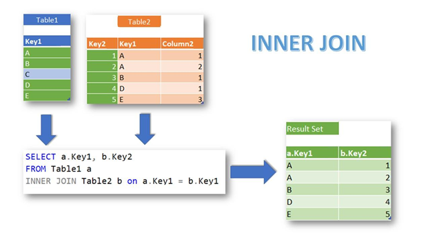
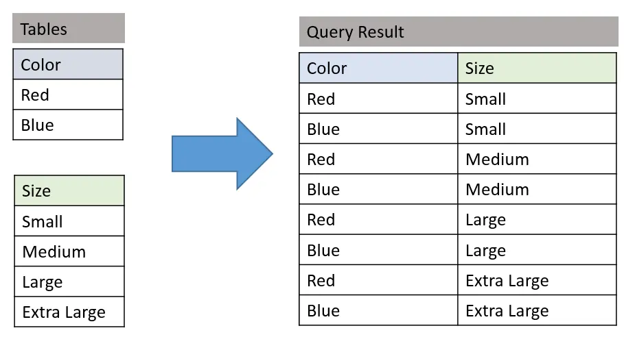

# Clausulas SQL

Clausulas SQL são comandos que são utilizados para filtrar e ordenar os dados de uma tabela.

## Sumário

- [Clausulas SQL](#clausulas-sql)
  - [Sumário](#sumário)
  - [WHERE](#where)
  - [AND, OR e NOT](#and-or-e-not)
  - [ORDER BY](#order-by)
  - [GROUP BY](#group-by)
  - [HAVING](#having)
  - [AS](#as)
  - [IN](#in)
  - [BETWEEN](#between)
  - [LIKE](#like)
  - [UNION](#union)
  - [IS NULL](#is-null)
  - [IS NOT NULL](#is-not-null)
  - [EXISTS](#exists)
  - [CASE](#case)
  - [MIN e MAX](#min-e-max)
  - [COUNT](#count)
  - [AVG](#avg)
  - [SUM](#sum)
  - [LIMIT](#limit)
  - [DISTINCT](#distinct)
  - [TOP](#top)
  - [Join](#join)
    - [INNER JOIN](#inner-join)
    - [LEFT JOIN](#left-join)
    - [RIGHT JOIN](#right-join)
    - [FULL JOIN](#full-join)
    - [CROSS JOIN](#cross-join)
  - [Ordem de execução das cláusulas](#ordem-de-execução-das-cláusulas)
  - [Referências](#referências)

## WHERE

A cláusula `WHERE` é usada para extrair apenas os registros que atendem a uma `condição especificada`.

```sql

    SELECT column1, column2, ...
    FROM table_name
    WHERE condition;

```

## AND, OR e NOT

As cláusulas `AND, OR e NOT` são usadas para filtrar registros com base em mais de uma condição.

```sql

    SELECT column1, column2, ...
    FROM table_name
    WHERE condition1 AND condition2 AND condition3 ...;

    SELECT column1, column2, ...
    FROM table_name
    WHERE condition1 OR condition2 OR condition3 ...;

    SELECT column1, column2, ...
    FROM table_name
    WHERE NOT condition;

```

Pode ser utilizado parenteses para agrupar condições.

```sql

    SELECT column1, column2, ...
    FROM table_name
    WHERE (condition1 AND condition2) OR condition3;

```

## ORDER BY

A cláusula `ORDER BY` é usada para classificar os registros em ordem ascendente ou descendente.

```sql

    SELECT column1, column2, ...
    FROM table_name
    ORDER BY column1, column2, ... ASC|DESC;

```

Para Ordenar crescente, utilize `ASC`, para ordenar decrescente, utilize `DESC`.

Caso não seja especificado, o padrão é `ASC`.

## GROUP BY

A cláusula `GROUP BY` é usada para agrupar registros com base nos valores de uma ou mais colunas.

```sql

    SELECT column1, column2, ...
    FROM table_name
    WHERE condition
    GROUP BY column1, column2, ...
    ORDER BY column1, column2, ... ASC|DESC;

```

Este comando é frequentemente usado com funções agregadas (`COUNT, MAX, MIN, SUM, AVG`) para agrupar o conjunto de resultados em grupos com base nos valores de uma ou mais colunas.


É preciso ter em mente que a cláusula WHERE não pode ser usada com funções agregadas, mas a cláusula HAVING pode.

Quando definimos que mais de uma coluna deve ser agrupada, o agrupamento é feito de forma hierárquica, ou seja, primeiro é agrupado pela primeira coluna, depois pela segunda e assim por diante.

```sql

    SELECT column1, column2, ...
    FROM table_name
    WHERE condition
    GROUP BY column1, column2, ...
    ORDER BY column1, column2, ... ASC|DESC;

```

## HAVING

A cláusula `HAVING` é usada para filtrar registros com base em uma condição definida após a cláusula `GROUP BY`.

```sql

    SELECT column1, column2, ...
    FROM table_name
    WHERE condition
    GROUP BY column1, column2, ...
    HAVING condition
    ORDER BY column1, column2, ... ASC|DESC;

```

Este comando é frequentemente usado com funções agregadas (`COUNT, MAX, MIN, SUM, AVG`) para filtrar o conjunto de resultados em grupos com base nos valores de uma ou mais colunas.

É preciso ter em mente que a cláusula WHERE não pode ser usada com funções agregadas, mas a cláusula HAVING pode.

O Uso de having sem group by é permitido, mas não é recomendado.

## AS

A cláusula `AS` é usada para renomear uma coluna ou tabela com um nome temporário.

```sql

    SELECT column_name AS alias_name
    FROM table_name;

```

Este comando é frequentemente usado para tornar o nome de uma coluna ou tabela mais significativo ou mais curto.

## IN

A cláusula `IN` permite especificar vários valores em uma cláusula `WHERE`.

```sql

    SELECT column1, column2, ...
    FROM table_name
    WHERE column_name IN (value1, value2, ...);

```

## BETWEEN

A cláusula `BETWEEN` é usada para selecionar valores dentro de um intervalo. Os valores podem ser números, texto ou datas.

```sql

    SELECT column1, column2, ...
    FROM table_name
    WHERE column_name BETWEEN value1 AND value2;

```

## LIKE

A cláusula `LIKE` é usada para comparar um valor a padrões semelhantes usando curingas.

```sql

    SELECT column1, column2, ...
    FROM table_name
    WHERE column_name LIKE pattern;

```

## UNION

A cláusula `UNION` é usada para combinar o conjunto de resultados de duas ou mais instruções SELECT.

```sql

    SELECT column_name(s) FROM table1
    UNION
    SELECT column_name(s) FROM table2;

```

## IS NULL

A cláusula `IS NULL` é usada para testar se uma expressão é nula.

```sql

    SELECT column_name(s)
    FROM table_name
    WHERE column_name IS NULL;

```

## IS NOT NULL

A cláusula `IS NOT NULL` é usada para testar se uma expressão não é nula.

```sql

    SELECT column_name(s)
    FROM table_name
    WHERE column_name IS NOT NULL;

```

## EXISTS

A cláusula `EXISTS` é usada para testar a existência de qualquer registro em uma subconsulta.

```sql

    SELECT column_name(s)
    FROM table_name
    WHERE EXISTS
    (SELECT column_name FROM table_name WHERE condition);

```

## CASE

A cláusula `CASE` é usada para criar diferentes resultados com base em condições.

```sql

    SELECT column_name,
    CASE
    WHEN condition1 THEN result1
    WHEN condition2 THEN result2
    WHEN conditionN THEN resultN
    ELSE result
    END
    FROM table_name;

```

CASE também pode ser utilizada no select, como uma coluna.

```sql

    SELECT column_name,
    CASE column_name
    WHEN condition1 THEN result1
    WHEN condition2 THEN result2
    WHEN conditionN THEN resultN
    ELSE result
    END
    FROM table_name;

```

## MIN e MAX

As funções `MIN e MAX` são usadas para retornar o menor ou o maior valor em uma expressão.

```sql

    SELECT MIN(column_name)
    FROM table_name
    WHERE condition;

    SELECT MAX(column_name)
    FROM table_name
    WHERE condition;

```

## COUNT

A função `COUNT` é usada para contar o número de linhas retornadas em uma expressão.

```sql

    SELECT COUNT(column_name)
    FROM table_name
    WHERE condition;

```

## AVG

A função `AVG` é usada para calcular a média de uma expressão numérica.

```sql

    SELECT AVG(column_name)
    FROM table_name
    WHERE condition;

```

## SUM

A função `SUM` é usada para calcular a soma de uma expressão numérica.

```sql

    SELECT SUM(column_name)
    FROM table_name
    WHERE condition;

```

## LIMIT

A cláusula `LIMIT` é usada para especificar o número de registros a serem retornados.

```sql

    SELECT column_name(s)
    FROM table_name
    LIMIT number;

```

## DISTINCT

A cláusula `DISTINCT` é usada para retornar apenas valores distintos (diferentes).

```sql

    SELECT DISTINCT column_name(s)
    FROM table_name;

```

## TOP

A cláusula `TOP` é usada para especificar o número de registros a serem retornados.

```sql

    SELECT TOP number|percent column_name(s)
    FROM table_name
    WHERE condition;

```

Este comando não é ANSI SQL. É usado apenas no SQL Server e no MS Access.

## Join

Um `JOIN` é usado para combinar linhas de duas ou mais tabelas, com base em uma coluna relacionada entre elas.


### INNER JOIN

A cláusula `INNER JOIN` retorna registros quando há pelo menos uma correspondência nas tabelas.

A cláusula INNER JOIN compara cada linha da tabela A com as linhas da tabela B para encontrar todos os pares de linhas que satisfazem a condição de junção. Se a condição de junção for avaliado como `TRUE`, os valores da coluna das linhas correspondentes das tabelas A e B serão combinados em uma nova linha e incluídos no conjunto de resultados.

Exemplo:

```sql

    SELECT column_name(s)
    FROM tabelaA
    INNER JOIN tabelaB
    ON tabelaA.column_name = tabelaB.column_name;

```



Apenas os registros que possuem correspondência nas duas tabelas são incluídos no conjunto de resultados.

### LEFT JOIN

A cláusula `LEFT JOIN` retorna todos os registros da tabela da esquerda (`tabelaA`), mesmo que não haja correspondência na tabela da direita (`tabelaB`).

Para cada linha da `tabelaA`, a consulta a compara com todas as linhas da `tabelaB`. Se um par de linhas fizer com que a condição de junção seja avaliado como `TRUE`, os valores da coluna dessas linhas serão combinados para formar uma nova linha que será incluída no conjunto de resultados.

Se uma linha da tabela `“esquerda” A` não tiver nenhuma linha correspondente da tabela `“direita” B`, a consulta irá combinar os valores da coluna da linha da tabela `“esquerda” A` com `NULL` para cada valor da coluna da tabela da `“direita”` B que não satisfaça a condição de junto (`FALSE`).

Em resumo, a `cláusula LEFT JOIN` retorna todas as linhas da tabela `“esquerda” A` e as linhas correspondentes ou valores NULL da `tabela “esquerda” A`.

```sql

    SELECT column_name(s)
    FROM tableA
    LEFT JOIN tableB
    ON tableA.column_name = tableB.column_name;

```


Observe que apenas os registros que possuem correspondência na tabela da esquerda são incluídos no conjunto de resultados, enquanto os registros que não possuem correspondência são excluídos ou retornados como `NULL`.

### RIGHT JOIN

A RIGHT JOIN combina dados de duas ou mais tabelas. A `RIGHT JOIN` começa a selecionar dados da tabela `“direita” B` e a `corresponder` às linhas da tabela `“esquerda” A`.

A RIGHT JOIN retorna um conjunto de resultados que inclui todas as linhas da tabela `“direita” B`, com ou sem linhas correspondentes na tabela `“esquerda” A`. Se uma linha na tabela `direita B` não tiver nenhuma linha correspondente da tabela `“esquerda” A`, a coluna da tabela `“esquerda” A` no conjunto de resultados `será nula` igualmente ao que acontece no `LEFT JOIN`.

```sql

    SELECT column_name(s)
    FROM tableA
    RIGHT JOIN tableB
    ON tableA.column_name = tableB.column_name;

```


Observe que apenas os registros que possuem correspondência na tabela da direita são incluídos no conjunto de resultados, enquanto os registros que não possuem correspondência são excluídos ou retornados como `NULL`.

### FULL JOIN

A cláusula `FULL JOIN` retorna todas as linhas das tabelas unidas, `correspondidas ou não`, ou seja, você pode dizer que a `FULL JOIN` combina as funções da `LEFT JOIN e da RIGHT JOIN`. FULL JOIN é um tipo de junção externa, por isso também é chamada junção externa completa.

Quando não existem linhas correspondentes para a linha da tabela esquerda, as colunas da tabela direita serão nulas. Da mesma forma, quando não existem linhas correspondentes para a linha da tabela direita, a coluna da tabela esquerda será nula.

```sql

    SELECT column_name(s)
    FROM table1
    FULL OUTER JOIN table2
    ON table1.column_name = table2.column_name
    WHERE condition;

```


Observe que a cláusula FULL JOIN retorna todos os registros das tabelas unidas, correspondidos ou não. Se não houver correspondência, os valores NULL serão incluídos nas colunas da tabela que não possuem correspondência.

### CROSS JOIN

A cláusula `CROSS JOIN` retorna todas as linhas das tabelas por cruzamento, ou seja, para cada linha da tabela esquerda queremos todos os linhas da tabelas direita ou vice-versa. Ele também é chamado de produto `cartesiano` entre duas tabelas. Porém, para isso é preciso que ambas tenham o `campo em comum`, para que a ligação exista entre as duas tabelas.

Para entender melhor, pense que temos um banco de dado, onde temos uma tabela `FUNCIONÁRIO` e uma tabela `CARGO`, assim poderíamos ter vários cargos para um único FUNCIONÁRIO, e usando o `CROSS JOIN` podemos trazer todos os CARGOS de todos os FUNCIONÁRIOS.

```sql

    SELECT column_name(s)
    FROM table1
    CROSS JOIN table2
    WHERE condition;

```



O `CROSS JOIN` é usado quando você deseja combinar cada linha de uma tabela com cada linha de outra tabela, independentemente da existência de uma correspondência.

## Ordem de execução das cláusulas

A ordem de execução das cláusulas é a seguinte:

1. FROM
2. WHERE
3. GROUP BY
4. HAVING
5. SELECT
6. ORDER BY
7. LIMIT

## Referências

- [Banco de Dados Relacionais – Parte V](https://drm-ava-gonline.infra.grancursosonline.com.br/gco/pdf/exemplo-aula-pdf/2021-07-26-08-35-03-50796000-banco-de-dados-relacionais-parte-v.pdf?response-content-disposition=attachment%3Bfilename%3D2021-07-26-08-35-03-50796000-banco-de-dados-relacionais-parte-v.pdf&Expires=1697651629&Signature=ieqcI7GFJoAsbWepNiM0oDSq1W0yVR1V128RJcYC8V4UxXQJTAOUSGZ9IU53vSkvWqbL1rdLATmb~~ujdNFSaojKNrdlcumxbx~vOKjHEdkhc7bGJmfeXvFSn8CKex1scY47XtstFLbEG~Go~mu6Lw~913hpwKexY08GIJTu5kDOUMOX3PSt8~bQzSW6iNZa2Bnr45I4KiBgL2JVCHhpmSoJuBxIe4djd1id96K73asWuFgnjC7yAo4KdAzY~Vo0q5IdI~cfAS59l20XDHVhfSIQxOObRcrlmwt7MXSLmnPXMXpIMK5MahdbbcY~vlk9OkPrA5xPyd5Dd01rvc4FRA__&Key-Pair-Id=APKAJWDRH5QWMLF2KNSA)
- [Merging queries](https://learn.microsoft.com/en-us/power-query/merge-queries-overview)
- [w3schools](https://www.w3schools.com/sql/default.asp)