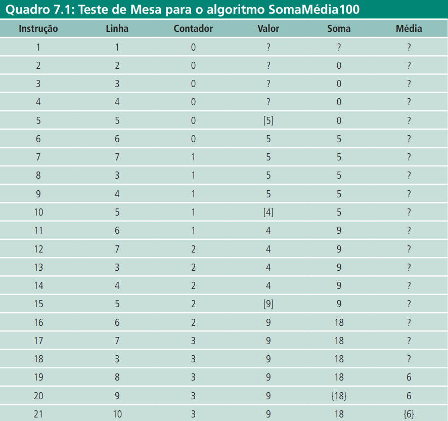
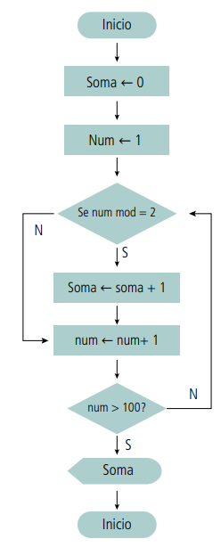

# Estruturas de repetição

## Índice

- [Estruturas de repetição](#estruturas-de-repetição)
  - [Índice](#índice)
  - [Introdução](#introdução)
    - [Estrutura de repetição para um número indefinido de repetições e teste no início: estrutura enquanto](#estrutura-de-repetição-para-um-número-indefinido-de-repetições-e-teste-no-início-estrutura-enquanto)
    - [Estrutura de repetição para um número indefinido de repetições e teste no final: estrutura repita](#estrutura-de-repetição-para-um-número-indefinido-de-repetições-e-teste-no-final-estrutura-repita)
    - [Estrutura de repetição para um número definido de repetições: estrutura para](#estrutura-de-repetição-para-um-número-definido-de-repetições-estrutura-para)
    - [Estruturas de controle encadeadas](#estruturas-de-controle-encadeadas)
  - [Referências](#referências)

## Introdução

No mundo real, é comum a repetição de procedimentos para realizar tarefas do dia-a-dia. Esses procedimentos são repetidos várias vezes, mas se encerram quando o objetivo e atingido. Por exemplo, quando uma pessoa aperta um parafuso, ela gira a chave de fenda uma vez, duas vezes, etc. até que o parafuso esteja apertado o suficiente. Durante esse processo, é verificado a cada volta, se o parafuso está bem firme.

Da mesma forma, podemos estruturar várias atividades diárias como repetitivas. Durante a chamada feita por um professor, por exemplo, ele chama os nomes enquanto não terminar a lista. Outras repetições podem ser qualificadas com antecedência. O aluno de castigo precisa escrever 100 vezes no quadro negro: “Nunca mais vou fazer bagunça”, executa a mesma instrução 100 vezes.

Todas as repetições têm característica comum: o fato de haver uma verificação de condição que pode ser representada por um valor lógico, para determinar se a repetição prossegue ou não. Essa é a base para a implementação dos comandos de repetição em algoritmos. Em vez de fazermos trabalho braçal, escrevendo a mesma instrução várias vezes, poderemos utilizar uma estrutura que indique que tal instrução será executada quantas vezes forem necessárias.

### Estrutura de repetição para um número indefinido de repetições e teste no início: estrutura enquanto

Antes de vermos a sintaxe em nosso pseudocódigo, vejamos um exemplo do mundo real: o problema do elevador. Um elevador residencial tem um comportamento que pode ser descrito de forma algorítmica. Vejamos o seu funcionamento:

Na subida: sobe cada andar, verificando se está em um andar selecionado dentro do elevador. Isso é feito até chegar ao andar mais alto selecionado dentro ou fora do elevador. Enquanto não chegar ao andar mais alto selecionado interna ou externamente faça:

```pseudo

Inicio
    suba um andar
    se estiver em um andar selecionado internamente então
    Inicio
        Pare o elevador,
        abra a porta,
        feche a porta,
    Fim
Fim

```

Mesmo exemplo de estrutura enquanto em python:

```python

while True:
    suba_um_andar()
    if estiver_em_um_andar_selecionado_internamente():
        pare_o_elevador()
        abra_a_porta()
        feche_a_porta()

```

Mesmo exemplo de estrutura enquanto em ADVPL:

```ADVPL

while .T.    
    if estiver_em_um_andar_selecionado_internamente()
        pare_o_elevador()
        abra_a_porta()
        feche_a_porta()
    endif
    DbSkip() //suba_um_andar()
enddo

```

Na descida: desce cada andar, verificando se está em um andar selecionado dentro ou fora do elevador. Isso é feito até chegar ao andar mais baixo selecionado dentro ou fora do elevador. Enquanto não chegar ao andar mais baixo selecionado interna ou externamente faça:

```pseudo

Inicio
    desça um andar
    se estiver em um andar selecionado internamente então
    Inicio
        Pare o elevador,
        abra a porta,
        feche a porta,
    Fim
Fim

``` 

O comando enquanto caracteriza-se por uma verificação de encerramento de atividades antes de se iniciar (ou reiniciar) a execução de seu bloco de instruções. Dessa forma, no algoritmo do elevador, antes de subir/descer um andar é verificado se o andar atual é o mais alto/baixo selecionado. Caso não seja, um conjunto de atividades é executado (sobe/desce um andar, verifica se é um andar selecionado e abre (ou não) as portas.

A sintaxe do comando enquanto é a seguinte:

```pseudo

Enquanto <condição - Valor booleano > faça
    <Bloco de instruções>
Fim_enquanto
<Continuação do Algorítimo>

```


Diagrama de blocos da estrutura enquanto...faça...fim_enquanto.

Voltemos ao exemplo do aluno de castigo. Fazer um algoritmo que escrevesse para ele, cem vezes, “Não vou fazer mais bagunça”, antes deste capítulo, seria uma tarefa bastante cansativa. O algoritmo seria:

```pseudo

Algoritmo Lição_Aluno_versão1

Inicio
    Escreva(“Nunca mais vou fazer bagunça!”);
    Escreva(“Nunca mais vou fazer bagunça!”);
    Escreva(“Nunca mais vou fazer bagunça!”);
    Escreva(“Nunca mais vou fazer bagunça!”);
    ...
    {O comando precisa ser escrito 100 vezes...}
Fim

```

Para que possamos utilizar o comando de repetição, precisaremos verificar, 
de alguma forma, se o comando já foi executado 100 vezes.

```pseudo

=
enquanto <não foi executado 100 vezes o próximo bloco> faça
escreva(“Nunca mais vou fazer bagunça “);

```

Bem, o problema reside em implementar essa verificação. Uma estratégia muito comum para esse tipo de situação é acompanhar a execução das repetições contando cada vez que o bloco é executado. Cada execução do bloco de instruções é chamada iteração. O próprio comando de repetição em conjunto com seu bloco de instruções é conhecido como loop ou laço.

Para que tenhamos a informação de quantas iterações já foram realizadas no laço, necessitaremos de uma variável que fará o papel de contador. Essa variável conterá o número de iterações já realizadas, sendo atualizada a cada nova iteração. Ex:

Faça um algoritmo que escreva 100 vezes o texto: “Nunca mais vou fazer bagunça”, utilizando uma estrutura de repetição.

```pseudo
Algoritmo Licao_Aluno_Versao2

var 
    contador: inteiro; 
Inicio 
    contador = 0; 
    Enquanto (contador < 100) faça 
    Início 
    escreva(“Não vou fazer mais bagunça!”); 
    contador ← contador + 1; { A cada iteração, conta-se mais 1 } 
    Fim 
Fim

```

Em python:

```python

contador = 0

while contador < 100:
    print("Não vou fazer mais bagunça!")
    contador += 1

```

Em ADVPL:

```ADVPL

User function Licao_Aluno_Versao2()

    Local nContador := 0

    while nContador < 100
        MsgInfo("Não vou fazer mais bagunça!","Título")
        nContador := nContador + 1
    enddo

Return

```

Outro exemplo:
Faça um algoritmo que leia 100 números e retorne a média desses valores.

```pseudo

Algoritmo Soma_Media_100 

var 
contador: inteiro; valor, soma, media: real; 

Inicio 
1 contador = 0; 
2 soma = 0; 

3 Enquanto (contador < 100) faça 
Inicio
    {Nenhuma iteração foi feita até aqui}
    {Ainda não foi somado nenhum valor}
    {O bloco será repetido 100 vezes}

    4 escreva(“Entre com um valor: “); 
    5 leia(valor) ; 
    6 soma = soma + valor;
    7 contador = contador + 1; { A cada iteração, conta-se mais 1 } 
Fim 

8 media = soma/contador;
9 escreva(“Soma: “, soma); 
10 escreva(“Média: “, media) ; 

Fim.

```

É interessante verificar o processo de acumulação de valores feito na variável soma (linha 6). Seu valor é atualizado a cada iteração, somando-se seu valor atual com o valor lido. Para que isso funcione, é importante que o valor inicial da variável seja definido antes da entrada do laço, para que um valor desconhecido não seja atribuído primeira iteração do laço.

Vejamos o teste de mesa para a melhor compreensão do processo. Para viabilizar a realização do teste de mesa, consideremos o laço até 3 e não até 100, como está no Algoritmo

Entrada: 5,4,9 (ou seja, os valores que serão entrados pelo usuário serão 5,4,9 nesta sequência)



Note que a condição de entrada/saída do laço está na linha 3. Esse teste é executado instruções 3, 8, 13 e 18. Perceba também que o teste é repetido sempre após o bloco de instruções (linha 7) pertencente ao laço.

Quando a condição é verdadeira, a ser executada é a do início do bloco, na linha 4 (instruções 4, 9 e 14). Porém, na instrução 18, a condição é falsa (no nosso teste, estamos considerando `enquanto` contador < 3) e a próxima instrução a ser executada (instrução 19) está na linha 8, após instruções pertencentes ao comando `enquanto`.

Em python:

```python

contador = 0
soma = 0

while contador < 3:
    valor = float(input("Entre com um valor: "))
    soma += valor
    contador += 1

media = soma/contador
print("Soma: ", soma)
print("Média: ", media)

```

### Estrutura de repetição para um número indefinido de repetições e teste no final: estrutura repita

Além do comando `enquanto`, existem outras estruturas para implementar laços repetitivos. O comando `repita` funciona de forma similar ao comando enquanto, exceto pelo fato de que a condição de controle só é testada após a execução do bloco de comandos e não antes, como é o caso do comando `enquanto`. Outra diferença é que os comandos serão repetidos pelo menos uma vez, já que a condição de parada se encontra no final. Sintaxe:

```pseudo

Repita
    <Bloco de instruções>
Até <condição - Valor booleano>
<Continuação do Algorítimo>

```

Assim, podemos utilizar o comando `repita` sempre que tivermos certeza de que o bloco de instruções será executado ao menos uma vez, sem a necessidade do teste na entrada do bloco. Vejamos o mesmo exemplo utilizado na seção anterior. Faça um algoritmo que leia 100 números e retorne a média desses valores.

```pseudo

Algoritmo Soma_Media_100_versao2; 

var 
    contador: inteiro; valor, soma, media: real; 

Inicio 
1 contador = 0; 
2 soma = 0; 

3 Repita // Enquanto (contador < 100) faça 
4 escreva(“Entre com um valor: “); 
5 leia(valor) ; 
6 soma = soma + valor;
7 contador = contador + 1; { A cada iteração, conta-se mais 1 }
    Ate (contador >= 100) 

8 media ← soma/contador;
9 escreva(“Soma: “, soma); 
10 escreva(“Média: “, media) ; 
Fim.

```

Em python:

```python

contador = 0
soma = 0

while true: # repita
    valor = float(input("Entre com um valor: "))
    soma += valor
    contador += 1
    
    if contador >= 100:
        break # interrompe o laço

media = soma/contador
print("Soma: ", soma)
print("Média: ", media)

```

Em ADVPL:

```ADVPL

User function Soma_Media_100_versao2()

    Local nContador := 0
    Local nSoma := 0
    Local nMedia := 0
    Local nValor := 0

    while .T.
        nValor := Val(MsgInput("Entre com um valor:","Título")) //leia(valor)
        nSoma += nValor
        nContador += 1
        if nContador >= 100
            Exit // interrompe o laço
        endif
    enddo

    nMedia := nSoma/nContador
    MsgInfo("Soma: "+Str(nSoma),"Título")
    MsgInfo("Média: "+Str(nMedia),"Título")

Return

```

Pelo exemplo, podemos perceber que a condição do laço `até` (contador >= 100) é diferente da similar no comando `enquanto` implementada na seção anterior. Isso ocorre porque a saída de um laço `repita` ocorre quando a condição booleana se torna verdadeira. Nos laços `enquanto`, a saída do laço só ocorre quando a condição se torna falsa. Outro Exemplo:

Faça um algoritmo que calcule a soma dos números ímpares menores que 100.

Um número é impar quando sua divisão por 2 não é exata, ou seja, o resto resultante da divisão inteira do número por 2 tem valor 1. Lembrando que em pseudocódigo, o resto é representado pelo operador: `mod`.

Como o algoritmo solicita a soma dos valores ímpares dentro de uma faixa de valores específica (0 a 100), teremos que fazer o acúmulo do resultado apenas quando a condição ímpar for atendida. Essa condição será testada por todos os números dentro da faixa, por meio de um laço.

```pseudo

Algoritmo Soma_Impares;

Var
    num, soma : inteiro;
Início
    soma = 0;
    num = 1;

    Repita
    Se (num mod 2 = 1) então
    soma = soma + num;
    Fim_se

    num = num + 1;
    Até (num > 100) 
    Escreva(“A soma é:”,soma);
Fim. 

```



### Estrutura de repetição para um número definido de repetições: estrutura para

Se analisarmos os exemplos de utilização de laços, percebemos que a maioria deles tem comportamento similar. Uma situação inicial, definida antes do início do laço como uma preparação para a sua entrada, um teste de controle para a entrada/saída do bloco e uma instrução dentro do laço que, em algum momento, fará com que a condição controle seja atingida e o laço se encerre no momento oportuno. O comando para procura resumir essas três características comuns à maioria das implementações de laços em uma só instrução, facilitando assim a construção típica de laços.

A sintaxe do comando `para` é a seguinte:

```pseudo

Para <variável de controle> de <inicio> até <fim> [passo <incremento>]
    < instruções >
<Fim_Para>

```

Portanto, temos a separação do comando em três cláusulas:

1. Preparação: `<variavel de controle> de <inicio>`
2. Condição: `<variavel de controle> até <fim>`
3. Incremento: `passo <incremento>`

A informação de passo está entre colchetes porque é opcional. O passo indica como será a variação da variável de controle. Por exemplo, quando for indicado passo 2, a variável de controle será aumentada em 2 unidades a cada interação até atingir o valor final. Quando a informação do passo for suprimida, isso significa que o incremento ou o decremento da variável de controle será de 1 (uma) unidade

Exemplo:

```pseudo

Para I de 1 até 10 faça
Escreva( I) ;

```

O comando escreva(I) será executado 10 vezes, ou seja, para i variando de 1 
a 10. Assim os valores de i serão: 1,2,3,4,5,6,7,8,9 e 10.

```pseudo

Para J de 1 até 9 passo 2 faça
Escreva(J)

```

O comando escreva(J) será executado 5 vezes, ou seja, para J variando de 1 
a 9, de 2 em 2. Assim os valores de i serão: 1,3,5,7,9.

```pseudo

Para J de 15 até 1 passo -2 faça
Escreva(J) 

```

O comando escreva(J) será executado 8 vezes, ou seja, para J variando de 15 
a 1, de 2 em 2. Assim os valores de i serão: 15,13,11,9,7,5,3,1.

Vale citar que, quando temos mais de uma instrução de preparação (primeira cláusula), estas são separadas por vírgula e executadas na ordem em que se encontram no comando. Quando temos mais de uma condição de controle (segunda cláusula), os testes também são realizados em ordem, e a condição toda é Verdadeira apenas se todas as condições forem, ou seja, é equivalente a uma condição lógica ligada pelo conectivo `E`. Não há como representar composição de condições `OU` no comando para. Nesse caso, deve-se obrigatoriamente fazer uso dos comandos `enquanto` ou `repita`. O comando `para` é executado da seguinte forma:

1. Execute a instrução de preparação na primeira interação do laço
2. Execute o teste de controle. Caso seja verdadeiro, passe para o item 3. Caso contrário passe para o item 6.
3. Execute o bloco de instruções
4. Execute o passo para o alcance da condição de controle
5. Passe para o item 2.
6. Saia do laço e prossiga o algoritmo.

O comando para é equivalente à seguinte estrutura: 

```pseudo

<instrução de preparação>
Enquanto < teste de controle>
Inicio
    <instruções>
    <passo>
Fim.

```

Para exemplificar, vamos refazer o algoritmo da soma dos números impares menores que 100 (feito anteriormente com as estruturas `enquanto` e `repita`) agora com a estrutura `para`.

```pseudo

Algoritmo Soma_Impares_versao3;

Var
    num,soma: inteiro;

Inicio
    Soma = 0;
    Para (num de 1 até 100 passo 2) faça
        Se (num mod 2 = 1) então
        soma ← soma+num;
        Fim_se
    Fim_para
    Escreva(“A soma dos números impares é:”soma);
Fim. 

```

Em python:

```python

soma = 0

for num in range(1, 100, 2):
    if num % 2 == 1:
        soma += num

print("A soma dos números impares é: ", soma)

```

Em ADVPL:

```ADVPL

User function Soma_Impares_versao3()

    Local nSoma := 0
    Local nNum := 0

    for nNum := 1 to 100 step 2
        if nNum % 2 == 1
            nSoma += nNum
        endif
    Next

    MsgInfo("A soma dos números impares é: "+Str(nSoma),"Título")

Return

```

Será executado o conjunto de instruções entre a instrução `para` e a instrução `fim_para`, sendo a variável num (variável de controle) inicializada com o valor 1 e incrementada de mais 2 por meio da instrução `passo` até o valor 100.

Reescrevendo o algoritmo o algoritmo para ler 100 números e retornar a média desses valores.

```pseudo

Algoritmo Soma_Media_100_versao3;

var 
    contador: inteiro; 
    valor, soma, media: real; 
    Início 

1 contador = 0; 
2 soma = 0; 

3 Para (contador de 1 a 100) faça
    4 escreva(“Entre com um valor: “); 
    5 leia(valor) ; 
    6 soma ← soma + valor;
7 Fim_para

8 media ← soma/100;
9 escreva(“Soma: “, soma); 
10 escreva(“Média: “, media) ; 
Fim.

```

Será executado o conjunto de instruções entre a instrução para e a instrução fim_para, sendo a variável contador (variável de controle) inicializada com o valor 1 e incrementada de mais 1 por meio da instrução passo até o valor 100. Este tipo de estrutura de repetição poderá ser utilizado todas as vezes que houver a necessidade de repetir trechos finitos, em que se conhecem os valores inicial e final.

### Estruturas de controle encadeadas

Em alguns casos, é necessário que sejam executados comandos de repetição dentro de outros comandos de repetição. Essa situação é conhecida como estruturas de controle encadeadas. A estrutura de controle encadeada mais comum é a estrutura de repetição dentro de outra estrutura de repetição. Essa estrutura é conhecida como estrutura de repetição aninhada.

Exemplo:

Faça um algoritmo que imprima a tabuada de multiplicação de 1 a 10.

```pseudo

Algoritmo Tabuada;

Var
    i, j: inteiro;

Inicio

    Para (i de 1 até 10) faça
        Para (j de 1 até 10) faça
            Escreva(i, “x”, j, “=”, i*j);
        Fim_para
    Fim_para

Fim.

```

## Referências

Advpl/TLPP

- [WHILE ... ENDDO](https://tdn.totvs.com/display/public/framework/WHILE+...+ENDDO)
- [FOR ... NEXT](https://tdn.totvs.com/display/public/framework/FOR+...+NEXT)
- [LOOP](https://tdn.totvs.com/display/public/framework/LOOP)
- [EXIT](https://tdn.totvs.com/display/public/framework/EXIT)
- [MOD](https://tdn.totvs.com/display/tec/Mod)

Python:

- [Ferramentas de controle de fluxo](https://docs.python.org/pt-br/3/tutorial/controlflow.html#)