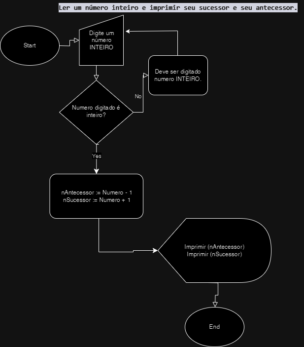
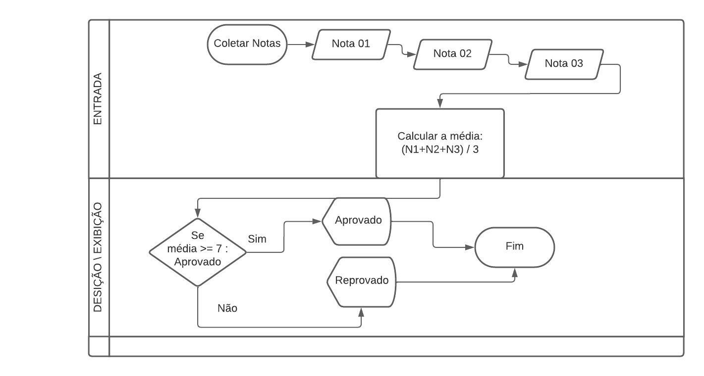

# Exercícios

## Exercício 1

Sobre o uso de variáveis e constantes em um algoritmo é incorreto afirmar que:

- a) toda informação manipulada diretamente pelo computador é armazenada na memória principal (RAM) e as variáveis representam referências a posições dessa memória;
- b) o valor de uma variável não pode ser alterado ao longo do programa, mantendo o mesmo valor até o encerramento do programa;
    
    `R: (b) Afirmativa incorreta pois se estiver utilizando uma linguagem de tipagem dinâmica, podemos alterar os tipos de dados atribuídos a variáveis.`

- c) o tipo de dado implica na forma como os dados são representados na memória;
- d) os vetores e matrizes só podem manipular dados de um mesmo tipo de dado;

## Exercício 2

Escolha a alternativa que apresenta, respectivamente, os tipos de dados mais adequados para variáveis que deverão armazenar os seguintes conteúdos: `idade`, `temperatura`, `nome da cidade`, `número da carteira de identidade`, `nota de um aluno`.

- a) Inteiro, real, caractere, caractere, real.
- b) Inteiro, inteiro, caractere, caractere, inteiro.
- c) Inteiro, real, inteiro, caractere, real.
- d) Inteiro, real, real, caractere, inteiro.
- e) Inteiro, real, caractere, real, real. `R: (e) Dados mais adequados para os tipos de variaveis propostos no enunciado: 30 | 37.5 | "Juquitiba" | 45.873.663-5 | 8.5 `

## Exercício 3

Assinale com um X os nomes de variáveis válidos

- (x) abc
- (x) 3abc
- (x) a
- (x) 123a
- ( ) –a
- (x) acd1
- ( ) -_ad
- ( ) A&a
- (x) guarda-chuva
- (x) A123
- (x) Aa
- (x) guarda_chuva
- ( ) ABC DE
- ( ) etc.
- (x) b316
- (x) leia
- (x) enquanto
- (x) escreva

## Exercício 4

Crie fluxogramas para os seguintes algoritmos:

- a) Ler um número inteiro e imprimir seu sucessor e seu antecessor.
  
  

- b) Calcular a média aritmética de 3 notas de um aluno e imprimir a mensagem de aprovado ou reprovado. A média de aprovação é 7.

OBS: Utilize a uma das ferramentas:

- [draw.io](https://app.diagrams.net/)
- [MindMeister](https://www.mindmeister.com/pt)
- [Lucid](https://lucid.co/pt)

## Exercício 5

Utilizando linguagem de programação de sua preferência, ou pseudocódigo, escreva um programa que leia o nome, a idade e o sexo de uma pessoa e imprima as informações na tela.

`R: CadSimples.tlpp | `
